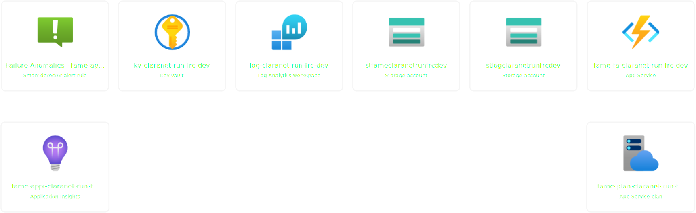

# Azure RUN feature
[](CHANGELOG.md) [](NOTICE) [](LICENSE) [](https://registry.terraform.io/modules/claranet/run/azurerm/)

A Terraform modules composition (feature) which includes services needed for Claranet RUN/MSP.

It includes:
* Log Management with following resources
  * Log Analytics Workspace
  * Storage Account with SAS Token to upload logs to
* Key Vault
* [FAME](https://github.com/claranet/fame) monitoring function for additional metrics. Built-in metrics sent:
  * `fame.azure.application_gateway.instances`: number of Application Gateway instances
  * `fame.azure.backup.file_share`: number of successful file share backups
  * `fame.azure.backup.vm`: number of successful virtual machines backups
  * `fame.azure.virtual_network_gateway.ike_event_success`: number of successful ike events for a VPN Gateway

It includes some IaaS specifics:
  * Azure Backup ([example](examples/backup/modules.tf))
      * A Recovery Services Vault to store VM backups ([documentation](https://docs.microsoft.com/en-us/azure/backup/backup-overview)).
      * A VM backup policy to assign on VM instances (via the [vm-backup](https://registry.terraform.io/modules/claranet/vm-backup/) module).
      * A file share backup policy to assign on [Storage Account file shares](https://docs.microsoft.com/en-us/azure/storage/files/storage-files-introduction) (via the [backup_protected_file_share](https://www.terraform.io/docs/providers/azurerm/r/backup_protected_file_share.html) terraform resource)
      * A diagnostics settings to manage logging ([documentation](https://docs.microsoft.com/en-us/azure/backup/backup-azure-diagnostic-events))
  * An Automation account to execute runbooks ([documentation](https://docs.microsoft.com/fr-fr/azure/automation/automation-intro)) ([example](examples/automation-account/modules.tf))
  * Legacy Azure Update Management using Automation Account ([documentation](https://docs.microsoft.com/en-us/azure/automation/update-management/overview)) ([example](examples/update-management/modules.tf))
  * A Data Collection Rule to gather metrics and logs from Virtual Machines ([documentation](https://docs.microsoft.com/en-us/azure/azure-monitor/platform/data-collection-rule-overview))
  * Azure Update Center using Update Management Center ([documentation](https://learn.microsoft.com/en-us/azure/update-center/overview)) ([example](examples/update-management-center/modules.tf))

### Default deployed resources


<details>
<summary>SVG code</summary>

```xml
@default.svg
<svg version="1.1" xmlns="http://www.w3.org/2000/svg" xmlns:xlink="http://www.w3.org/1999/xlink" width="1723.75" height="530"><defs><clipPath id="UNxNRLpszxDp"><path fill="none" stroke="none" d=" M 3.0000000000000284 25.500000000000007 L 3 115.49999999999999 L 182.99999999999994 115.5 L 183 25.50000000000002 Z"/></clipPath><clipPath id="ynfwxKASemel"><path fill="none" stroke="none" d=" M 3.0000000000000284 266.5 L 3 356.5 L 182.99999999999994 356.5 L 183 266.5 Z"/></clipPath><clipPath id="XMFMGpapfcdJ"><path fill="none" stroke="none" d=" M 235.00000000000003 25.500000000000007 L 235 115.49999999999999 L 414.99999999999994 115.5 L 415 25.50000000000002 Z"/></clipPath><clipPath id="gQfigQuBfOdF"><path fill="none" stroke="none" d=" M 467 25.500000000000007 L 467 115.49999999999999 L 647 115.5 L 647 25.50000000000002 Z"/></clipPath><clipPath id="wXUflmSWpJTv"><path fill="none" stroke="none" d=" M 699 25.500000000000007 L 699 115.49999999999999 L 879 115.5 L 879 25.50000000000002 Z"/></clipPath><clipPath id="HnoJMWyTSMkA"><path fill="none" stroke="none" d=" M 931 25.500000000000007 L 931 115.49999999999999 L 1111 115.5 L 1111 25.50000000000002 Z"/></clipPath><clipPath id="ADldDNTyKWEe"><path fill="none" stroke="none" d=" M 1163.5 266.5 L 1163.5 356.5 L 1343.5 356.5 L 1343.5 266.5 Z"/></clipPath><clipPath id="vTTxWTKqsPql"><path fill="none" stroke="none" d=" M 1163.5 25.500000000000007 L 1163.5 115.49999999999999 L 1343.5 115.5 L 1343.5 25.50000000000002 Z"/></clipPath></defs><g transform="translate(20,-9.375) scale(1.25,1.25)"><path fill="none" stroke="rgb(255,255,255)" paint-order="fill stroke markers" d=" M 93 189.5 L 93 247.5" stroke-opacity="1" stroke-linejoin="round" stroke-miterlimit="10"/><path fill="rgb(255,255,255)" stroke="none" paint-order="stroke fill markers" d=" M 88.65 240.8 L 93 249.5 L 97.35 240.8 Z" fill-opacity="1"/><path fill="none" stroke="rgb(255,255,255)" paint-order="fill stroke markers" d=" M 1253.5 189.5 L 1253.5 247.5" stroke-opacity="1" stroke-linejoin="round" stroke-miterlimit="10"/><path fill="rgb(255,255,255)" stroke="none" paint-order="stroke fill markers" d=" M 1249.15 240.8 L 1253.5 249.5 L 1257.85 240.8 Z" fill-opacity="1"/><path fill="rgb(238,238,238)" stroke="rgb(245,245,245)" paint-order="fill stroke markers" d=" M 93 9.5 L 191 9.5 L 191 9.5 A 8 8 0 0 1 199 17.5 L 199 180.5 L 199 180.5 A 8 8 0 0 1 191 188.5 L -5.000000000000002 188.5 L -5.000000000000001 188.5 A 8 8 0 0 1 -13.000000000000002 180.5 L -13.000000000000002 17.5 L -13.000000000000002 17.5 A 8 8 0 0 1 -5.000000000000001 9.5 L 93 9.5 Z" fill-opacity="0" stroke-opacity="1" stroke-miterlimit="10" stroke-width="2"/><path fill="rgb(238,238,238)" stroke="rgb(245,245,245)" paint-order="fill stroke markers" d=" M 93 250.5 L 192 250.5 L 192 250.5 A 8 8 0 0 1 200 258.5 L 200 421.5 L 200 421.5 A 8 8 0 0 1 192 429.5 L -6.000000000000002 429.5 L -6.000000000000001 429.5 A 8 8 0 0 1 -14.000000000000002 421.5 L -14.000000000000002 258.5 L -14.000000000000002 258.5 A 8 8 0 0 1 -6.000000000000001 250.5 L 93 250.5 Z" fill-opacity="0" stroke-opacity="1" stroke-miterlimit="10" stroke-width="2"/><path fill="rgb(238,238,238)" stroke="rgb(245,245,245)" paint-order="fill stroke markers" d=" M 325 9.5 L 423 9.5 L 423 9.5 A 8 8 0 0 1 431 17.5 L 431 180.5 L 431 180.5 A 8 8 0 0 1 423 188.5 L 227 188.5 L 227 188.5 A 8 8 0 0 1 219 180.5 L 219 17.5 L 219 17.5 A 8 8 0 0 1 227 9.5 L 325 9.5 Z" fill-opacity="0" stroke-opacity="1" stroke-miterlimit="10" stroke-width="2"/><path fill="rgb(238,238,238)" stroke="rgb(245,245,245)" paint-order="fill stroke markers" d=" M 557 9.5 L 655 9.5 L 655 9.5 A 8 8 0 0 1 663 17.5 L 663 180.5 L 663 180.5 A 8 8 0 0 1 655 188.5 L 459 188.5 L 459 188.5 A 8 8 0 0 1 451 180.5 L 451 17.5 L 451 17.5 A 8 8 0 0 1 459 9.5 L 557 9.5 Z" fill-opacity="0" stroke-opacity="1" stroke-miterlimit="10" stroke-width="2"/><path fill="rgb(238,238,238)" stroke="rgb(245,245,245)" paint-order="fill stroke markers" d=" M 789 9.5 L 887 9.5 L 887 9.5 A 8 8 0 0 1 895 17.5 L 895 180.5 L 895 180.5 A 8 8 0 0 1 887 188.5 L 691 188.5 L 691 188.5 A 8 8 0 0 1 683 180.5 L 683 17.5 L 683 17.5 A 8 8 0 0 1 691 9.5 L 789 9.5 Z" fill-opacity="0" stroke-opacity="1" stroke-miterlimit="10" stroke-width="2"/><path fill="rgb(238,238,238)" stroke="rgb(245,245,245)" paint-order="fill stroke markers" d=" M 1021 9.5 L 1119 9.5 L 1119 9.5 A 8 8 0 0 1 1127 17.5 L 1127 180.5 L 1127 180.5 A 8 8 0 0 1 1119 188.5 L 923 188.5 L 923 188.5 A 8 8 0 0 1 915 180.5 L 915 17.5 L 915 17.5 A 8 8 0 0 1 923 9.5 L 1021 9.5 Z" fill-opacity="0" stroke-opacity="1" stroke-miterlimit="10" stroke-width="2"/><path fill="rgb(238,238,238)" stroke="rgb(245,245,245)" paint-order="fill stroke markers" d=" M 1253.5 250.5 L 1352.5 250.5 L 1352.5 250.5 A 8 8 0 0 1 1360.5 258.5 L 1360.5 421.5 L 1360.5 421.5 A 8 8 0 0 1 1352.5 429.5 L 1154.5 429.5 L 1154.5 429.5 A 8 8 0 0 1 1146.5 421.5 L 1146.5 258.5 L 1146.5 258.5 A 8 8 0 0 1 1154.5 250.5 L 1253.5 250.5 Z" fill-opacity="0" stroke-opacity="1" stroke-miterlimit="10" stroke-width="2"/><path fill="rgb(238,238,238)" stroke="rgb(245,245,245)" paint-order="fill stroke markers" d=" M 1253.5 9.5 L 1351.5 9.5 L 1351.5 9.5 A 8 8 0 0 1 1359.5 17.5 L 1359.5 180.5 L 1359.5 180.5 A 8 8 0 0 1 1351.5 188.5 L 1155.5 188.5 L 1155.5 188.5 A 8 8 0 0 1 1147.5 180.5 L 1147.5 17.5 L 1147.5 17.5 A 8 8 0 0 1 1155.5 9.5 L 1253.5 9.5 Z" fill-opacity="0" stroke-opacity="1" stroke-miterlimit="10" stroke-width="2"/><path fill="rgb(153,153,153)" stroke="none" paint-order="stroke fill markers" d=" M 3.0000000000000284 25.500000000000007 L 3 115.49999999999999 L 182.99999999999994 115.5 L 183 25.50000000000002 Z" fill-opacity="0"/><g clip-path="url(#UNxNRLpszxDp)"><g><image width="73.28571428571428" height="89.99999999999999" opacity="1" preserveAspectRatio="none" transform="translate(56.35714285714286, 25.500000000000007)" xlink:href="data:image/png;base64,iVBORw0KGgoAAAANSUhEUgAAAEkAAABZCAYAAABypQlHAAAGfklEQVR4Xu3bC3BMVxgH8O+mtINqPadVVFQ28YpsK9IOYhJRSltCSVsVNolnUFRL41ERUeOdENKIyKboFFWPGjWI0rQeSapSikiRTgWdDjnDeBTN7Tk7Te5ZsnfPZbvfTnLujBkT396932//57v3blwF5OZUQHFaIQtAIgmEQCJJJAEBgRKZJIkkICBQIpMkkQQEBEpkkiSSgIBAiUySRBIQECiRSZJIAgICJTJJRpHi88wh9DUh4AUtBF5btUvKICu+07H9rMmKJH2SZ45XFJhVtTs32J0CSbM7HptUgTQr13xeBfA2uJuqXa4ASeh0rL6WpCPmUtpxvardteHuSMLLHNLMwwGloEokO0aapDmvFGhJmnGQIinuR2rTIBRCm46GWjXqVvoxl/59EQ5dXg+nrn5nOAaP/AIVSGJnHunHgFI6k9y+3CZ33An1n3hOt5/b965DYm7wI/dsdAd0FpHELhzS9B9okjCQAp0jsTQtzu9jtEdX1JO5XTmkaTkdUJDGvbgRmtTx022o9PZFWJTf2xVNG90H+TT4F20mxX2PgzT+JedIl24UwvKjEUYbdEU9mdeNR9rfAWUmjQjIgBfqBeo2dI7kQ3pBjCuaNrQPNpPmhXBIUykS/aHbB7cnI9ETGZlvh7TPH2UmRfonQbtG3XU/4Z8ub4NNp2YaSoGLisn87se1mTQlGwdpKENqrI+UfwkPaUEYh/TRXhykiLZzILBJP90PPuePdfDNmQUuCoeh3ZCFPXikPThIb/pOgeDnh+ge+Z5zqcD+IGxk4asc0oe726Pcu/X1o0gtInX73164AHJ+X+t+I3rvtqjnCW0mTd5FkRDObv1aO0facGIG5JVscz8SPbstfo1D+oAhIXwL0MsnFnr6jNEFyPx5Apz4c5/7kWiSltgh7cRJUi+TANJRJCSapCV9uCRN2tEOZbl1axkJ4W2n6qZk5eEo+O1KnvuTRJGWvvGrNpMmIiEFNQuHdwMSdQEW5QyEkmunUZCSeKQJ23GSFNQ8HAab9ZESsnvB1ZslKEjJfbkkTdiGg+T/bBjEBCXrAiTsRUTqxyNtbUe/BVDdfoPr3yQMhgct00WiHyBGiui32QpJDueQ3t/SFmVw+zTqBOO7WvWRtuIg0YMiy/qf1Ab3+K8pEsJ1kqkxRQp2jMRmUfyunihJolEiywdwSOM24ySp2dOtYWrYZocIDGkWFhJNUspbPNJXDMn9M6lB7aYwu/ceh0gXyGmYnz0AJ0l0JqUM5JDGbmqDMpMa1tFHKvorF5IPWJCQgKwYdEqbSTYkhJlUq2ZdWBh+xCHC4eItsC5vOg4SnUl2SLEbcZLEuh9o/hhCTUMfgLh19zqszZsGBSXZOEh0Jq2M4JIUu4EhuX8mlXfPElX78afsMG7euQYMCm9TyMq3OaQxX/pRJMXtF5N4ACLvrJLUdwq1mWRDUiWSHZ1yH9KoL/zo790kEo9Eb9NI2mAuSaPW4yL5PhMEr7cfWzGXrtwogR3HU+BCKcpXJDYrG9J79yHRn6PMJAY0Ojil0sE999v+wMCQtvuQ1rHBjYMU1noYDOoYV6lD1qE4OHRuC5IRkLQhXJJGrsVDigiMAwZV2caQDp7FQ1oVySN9jozUxgHSQWSkoRzSiCxftOVmbt4DYkNXVJqkxbsjofByLtpySx92RrtOGmHFQ2ICli7zoLOPdrfPrrZ3FKTA3pNZWEDsfUm6hUMajoxULtHwyaa2v966cx0YFPJGVtshZeImCRnD0duT1VFckmLWSKRKpEhGtB2SCW1we2iKbDMpI7pIG9zRGabz9Drc24MP2P2HpkDxmpiilhUP4ESvNmWyk4z7j8SD35E+ykWRtEe52KFGp5uW0v9xavZCuj0p5/rvkTKj95EEFHW/y8hVOFBW457VGlVMPPLxUkumdz2vf2pkqqoSLtq0qkKUdWSRVbTeSJ1HIpU3YEnziVe8FKGnOastEsOypPqEKI8p7A5Xd/nRJVo9k1SRKLr8lLs12QNvZkfLpNojacvPtJT+fn6iA6jqnSQexZLmS4e5+uAXTGV0uY2phoPb0dKyrDKZQVXZdZ22/MpUinS2+p3dnJ2mh33WikIptgtgRZVIDr0sqa0sZaB4e92+l2SdVEycwT7Mv3v0ddLDNPR/vEYiCahKJIkkICBQIpMkkQQEBEpkkiSSgIBAiUySRBIQECiRSZJIAgICJTJJEklAQKDkX7BvPXjbC56tAAAAAElFTkSuQmCC"/></g></g><path fill="rgb(153,153,153)" stroke="none" paint-order="stroke fill markers" d=" M 3.0000000000000284 132.5 L 3 144.5 L 182.99999999999994 144.5 L 183 132.5 Z" fill-opacity="0"/><text fill="rgb(255,255,255)" stroke="none" font-family="Helvetica Neue, Helvetica, sans-serif" font-size="13px" font-style="normal" font-weight="normal" text-decoration="normal" x="93" y="145" text-anchor="middle" dominant-baseline="text-after-edge" fill-opacity="1">Failure Anomalies - fame-ap…</text><path fill="rgb(153,153,153)" stroke="none" paint-order="stroke fill markers" d=" M 3.0000000000000284 144.5 L 3 172.5 L 182.99999999999994 172.5 L 183 144.5 Z" fill-opacity="0"/><text fill="rgb(255,255,255)" stroke="none" font-family="Helvetica Neue, Helvetica, sans-serif" font-size="10px" font-style="normal" font-weight="normal" text-decoration="normal" x="93" y="163.5" text-anchor="middle" dominant-baseline="text-after-edge" fill-opacity="1">Smart detector alert rule</text><path fill="rgb(153,153,153)" stroke="none" paint-order="stroke fill markers" d=" M 3.0000000000000284 266.5 L 3 356.5 L 182.99999999999994 356.5 L 183 266.5 Z" fill-opacity="0"/><g clip-path="url(#ynfwxKASemel)"><g><image width="73.28571428571428" height="89.99999999999999" opacity="1" preserveAspectRatio="none" transform="translate(56.35714285714286, 266.5)" xlink:href="data:image/png;base64,iVBORw0KGgoAAAANSUhEUgAAAEkAAABZCAYAAABypQlHAAARwklEQVR4Xu2cC3BU1RnHv3v37oYkAkmQl4ImVYyIYKLFRx0tsdbOyEwJ+GKotkGt1eq0ULU6tlUcbevYWnBqq51WYUYEaqtZa31VW6JUq1JNeMhD0URUBBRZHnlsdu+9/b7znXPv2WWT7G52N63dy+zcfdzsPfu7/+9/vvOdczGguA1IwBjwiOIBUISUhgiKkIqQ0iCQxiFFJRUhpUEgjUOKSipCSoNAGocUlfS/AqmpsbUC21odwAe12QWocAA68GnHsnA97Yd0GxIlIZQ604FGwzBmIRACQ5D63fC4FsN1X3RMWFZocAWDRGpBMAskmDpFRDUA308JyXURD6vL2/DINtc1WhzTubcQwPIOieGYt4HhNpFi6IQEhPf4oH9iT5v3RFJxBRziRM94T6/5faZnLHnoLyctHEiJg/k8r5AQ0AzTNZZiA6vpRCbS4AeDouc6qFQ/RAfkEBx8OEiInovX/EcRvAgLHwrXLxsMjL7+Ni+QhHoYTqMAgU8CSMaDRM+lgngvdZTUGhlpDEYqifYOUlKQbHxOoCSwlqVP1DXkGlTOISlA+MUCEMEJkGrU3jB9BXlK8sNNNUg5kQgvFXJCSUpFDtgEDyHRnmARKNzabMNtQK+K5ApWTiGJXss1mhFONYERgDQ4Sk0kHKUg4U306Me4fVCaojwwDIsgiQeHYcRhUG25AJUzSAoQwqlmOCZYApCZGGoaIBWKzIfDUt88NUnD9jyJQk7zJYbjQFyAQmgMK2egcgKJQizgGqvxR9cRGCuAYBCOhaA4zMi0OcyUcStP8no6wckHJQBJY/Z6NAKTBMhBODa9j2DiBIhg2RIYgnroibrKwaopJ5Aub1y3GLPlBQTFQiJiT1DwuQg71IhJwPBs9Fr1bKYMM7VP3btRiHG3T3ulJg4rgoNgEJx4jbTiQlEEiqHh8eEHn6ibPRhQg4Z0eWNrUwDMpQmAEAh7ESkq2bi1Xi4pT+Kok01KUBHnSXqIEawE4xavOdQEJB0UOLMfDNeHswU1KEgYZtUWmK1B06igEBOgdC9K6N00YFqupExb2tIhpqQnj3qOJMxa9G6acUtQ5E0+KAdijhuJg1OfbXY+KEhXNrYusszAbQQm6EFSZi2hyN6NjmFvUkkkJ5L0mm370B5Oz6w5zGTYyUSSvIh9yO/ZhHFLE6fPYsKfCJSz7MFw3fxs1JQ1JDLrkGG2I5yKoFBPgP1I9GbkSdz9j5kQhGOmhaBmaki0b+8OG3a/Z8N7b8Y5X5JwvIZo4Sa8W/qRShgrxpkwYUoAJk4JQrTLgT34fZtei8LuD2McagIYghEGToqyCRDBivS62akpa0ikomDAuo0UxJC4y/cg4fMppw+DMxvLIFR66Gna34jD2sd6eRyneVNCCqCP2fDHjz8+AKddFPK+T2Xk9DcbX4rCi48f9NIANnAOOwkJQcUX/iFcvyRTNWUN6TuzN7QGA0ZdIiSZGyGwoyaFYNa1w7329Pa4EBqWeLodW2x4bUXMG/Cm7N2kkkbVmHD2fFYjbfR9nXtdqBxPfSNva5/tglef7WYlab7kQ3Iiv2uelnFKkBWkKxpbG0sCVjMD8sPMUxNCuuTGkTDqiID4Meuf74V2DC8nCnDiuSGYck7Q+2Gvr4rDzi1OSlAq1OjgM5qCMFoMkwHefiUOG1/ohZ5uB6wSA75yVSlUSVjL74zA3k/jPiQZdjEKO/QnVNP832c4EM4K0lVz1i0ImYHFoQABIlAcZgrSWPShC64fIX7Qlpdj0PpUVPiUGsudPq8ExtfyqXdtdeGNR+0+p5IJ1PCxLpx1FYP99H0X1jwU9cZqpBoCddGiw8Tnr4Q7oa2lOwES9m4iwey1bfKo2x94/KRF3lVK40lWkK65YENzKGA2KhUFFSDZw51wagmcPbdMnH7Nwz3w8WZbJJNq7HbE5ABMn2uJz+M9AC/8Iu7XkxIazSP8MccZcPIlmK7i1v6qA+ufiYmkUgxqZe924a3lYGE4b/pnFNY0d8k8SfZsmpp6bSd8/2NTM0ous4J07QUb20OWWS0Mm5SkQaL3jsGerOFbDOn5+7ph/67EUslo9JfTvulDWv1LqaQ+hiVHnQZQ+1WG1PGaAxufxdBVaYAcr828oQzKKw3Y9u9eaFnVJcyahycYYnKowt5kR+7789SMfCljSN/Gkf6wYLAVww0sywckQg7Dj/YVowIw52Y27U3/iMHWFjthkHs4Qjr1Mv7RpKQX7+nfkyZMN6D2PG4qQdr0nJ0AqepoA758RYnIF9b+NQobXuqmBBIhUfcvezgCFceQI2+KxWoeyGCCIWNIV1+4YUaJaa6mUMPeTeRHAhAllDKpLCsLwPnfoyvLPU9rOAYfrXM45FAtVUcDQvKVtGaxq5Vw/XhTdaQjv+jCpHP5u7avdWDz31QtyYEK/K6TZ4WgFAvDsW4XXlzeBTvejbNJy+EJgyLjdvE9G6Jxe/4Dj09blhDZ/bzIGNI1F6z3ezYVajJXEpAow8bX42osaLhiGJ7aP8WBXVz8oBTysLF+qzp3yyJsPw0tH+1/z/5dNNTl2veIcf777/wrBm88jaYuABEQCYpeo5K4d0M1xePzf5tPSNchpKBF3T8pSCWShqciNX4jk649Iwgnnud394cyyPQa9Q1z+zob2p7FtACzcDVu89XkA0NPgmisAJBCVlDmSBKSpiQe6PLIn4BRsjdxmgWVR5kwfIyPaWA8qYHo78Z7DNj7gQM7t9rwPkJS4ziRSMpwUwauVMXgYvN//ac8htt15EmWtVoMaLFXUxm38iMxkJUepfaUH9H7qmxbNdGEqRdyJEbexeTwaSrBpd4IyriTHJh4Fn++oxVgWwvWieTEgKwZMSBVeFNmrYESA10ZclEnNvu+R6elXToZ+IImtZ0hBREShpiERABC0rS9sq0cz6lSLhfbMBVAHBUI6YRGNGv87kg7wLvP0bu8qVq3Pik5ZpoDE77EGvp4HeZKL2GOJCFxBUAH5Jdxhf8o8/Z8yYWo05tfSAuoVDusdO8hkGT33x8kqkxSGXfkkQZM/jpD2deBP/p5VpIq5QpTFsbMyeToKQ4ceQYfv3MDpgEvUwGOqo4gyyR9QMIDOMuWpi2UJADXLFk1Gc+c3paxkuhrr5+7BUskRnWmShKQEMcIhFQ7kxu4f7sB7//dh6Q3W0E6fLID408Tc7iw+y0Dtr/CsyYDQkqtpI57Vh1fkx4ePiorSDdcsmWxZRkLRKatd/964a2fcBs+3oBjv8YnP4CQPljTvydV1bow9hTu9j/Z7MKHr6OCBgg3Tz3JaUDcDd/zx+PzPyz5wdzNTWjYS4WS5NBEeJJ8rubaeNaEp5d4gMtKohzpC+dKSB8a8PHLmChqQxJ1ldWMScVxLoypI+0A7NlqwEdvaEoSfsTJJfVoqkqpejfhScrA2bjn/2rV5GV5VxKd4KZ5W9vRsMX4jRJIzpu4F6NkkiuTfk/nTychJEwFqr/MRtz5sQE7X5XGnTxBKT1pxDEOjJ7KSvpsmwk72vxpbhrDqZ6NK5LoOV7JFvMjOTSR2XdHtKurfkmGs7tZhRs19ofzNi/CoQnWt304pCahHgWLQElgakhCHMpHAUw8k69l104DPnmTISU3Rpg3PoYfbUPVCVzjjnRgeWUjZ9tqIkCBEWpSPZ3uR2pYgmWSu1dMXpSJirL2JPrDBU3tFaWx2F5VutXV5ClIQlIhp9REkMbjeIy27k8M2LNeg5RiSumwiS6MPM4WxPZtx5rSFkMb4MoQE3mQmu6WwxJtgIs5UsSJ2/V3ZdCrKZhZK4m+4OZ56E2mJefc5ABX1roVKG8vw49AlVaiEZ/EkKJ7DPhsk+UrSbVI1Lf5UTbegZHHkFWj0X+Ex29jSMqLeB2AnN6WpVt93CZMHJzb71pem7GKBqUkRflHl77Tij5Up1cCxISA9CNPRd7qEhOGjQQ4HHMf4hHda8C+ragkbWqJvlsNPygNKB3nwGFHoyfhmwcxPCMdCEmatVhVok0r8biNx2o8CSBCsKXTsmYvWVaT1UqTQSlJqGnu5upQMIgm7pdLvAlKDZS/9MZASCZUTGJIsf0GHHhPrAxIaRWUGw0b40LZEdy7de02MLdi405eeqNPAChICAynkmKz71o+uSVTL8pJuHlquuydxZgO4FoAHZTfu4naNk1KSjWFygFGYjpH4okfMKHzQx7XpdrIoEOVDgwby5B6PiU1KdP2ltrIpTeJKuIZk/jtd2YZZjmFRF92K4Yd9mS4qsQvn1AaoNe2FahQGaYBR/LYze4yoGcXVymT1yip8Zs1woGSUTwMie5DNX3Cq0jkWiSv1k3GrYcapgJtpmU1LMoyzHIOicKuRISdnKTUDFzNkqjeLYgF+1IMIVKPg+WO2B5SUh/hhj88UO6CNZKUZEDvfhd60Fn0GrcycX+uTczkRmJxu+FnK44b9EKuQXuSHiI/vnRro2VazaKeRJBEiYSfC0D4nIqwFs4xluDKbQLjxgywMeT6K5WYJS6YCAooY0blRQ/KZTg0W6KmtfUpbjJu21n400cmZTxbmyrkcwqJTvCTy7Y1I5xGb7WbBMVqYu8JBDFDR1+ik7txfPToeZJsppYCQBDr4wiKtjhOcFItWyST2Htxxu2vAZDrAcJ3PHxsRuOz/kw955AWYZLp2HY7+k+FXktif5Jrk3AOIIATijSWw5Eq/ur+lQQB7P4RLHmUHcNHrww3BUerKdEywN5YLKuksS9QOYdEJ7pl3ttNaOJLvcWlsncTiSUNcgkW/mixqkQsX+NmpBi6cbtNVA4eQlpy4jw2o2U3Xn6kLb3B3mzhzx85PidhlnPjTr4Kt3zj7VaEVOdNbws4/polLrARKLJjLUvShiX0nXrxTZRsEWriAi5WlciRwG3ptoJZJ40FVRKdjHo7IxCgsOM1AHq4yffIxJNX4CY21L9VQvRmpCQ5cyv2ehpAFQPbbsCxWUt//pLNZ3kJN9WQG+dtxZCDJgGIVKPVlMiPeG2SXMglwi2xOaoy6alJANJW4JJxq0WlDoTvXlmbM7PWYeYV0gJUEw5d2/1lyhKWhCNA0T/ZCrHTws0fv/kLS3ndpCq6UUIplyeD24B165yrSDQpG/ll8jffv/itZlyF26jCjRiInEn6kH/HUt/JZLIvqfWT3i0TrhO+99EpeVFRQSB996K36gLgtrIvqQXvKtR8Jcn+zbtqrKIUt3KpkBMDXJUnObPvfyz9ebRMLnJBINFJrp69nkJO3E7hrb4VPZt2r5v0Jv0HCFCyhEvJI9+JlHiHEiaPWS3xywRU3sONGnMl3jGAJ1rgDU1kyHk3BHrmnWTcnpJUL6cAsQ9Jbwrj0uO8hVrBlERrLPF20GZCoDxIqUilABRnyTUlEWxyeOL5kKcsDkXDcAe12j8dRRVESfIeuL3J3WpyNZJ7N3mUhMPOxFvCbaXyPbxlqybblf7pACqYkuhEl89qW4q7pnQbluZxYbwLKa+hVlBIUk2LMbzOwftl/cXXadJIOMw18IYk9z3XcOfnW0UFhaR+ZGtrax2GDS6gyX7Dv194yimn5HQQ219rCuJJegOyhWTjHFpnZyd0d3fTTMlvZs6ceV32mDP7y/9KSDoQgkJwolFaC0nFJ4DKysrwxRdfnHcvUiiHHJIOJBKJ4DLiOHR1dSVc6gCuMygpKYHhw4eLfWlp6R0zZsy4NTM9ZH90wSE9+eSTl2BzVx08eFCogx76RkDKy8sJRAIYel9tn3tPWr58+a0YPrfTD9aBKJWQUnQgqa7/5x7SM888cz6q5CnLsqCsjG+t6G9LFY4I8v/Lk3RACsiBAweAwrEvf6qqqlo5Z86ceQMBztXnBfcklQKkC0T5kwpHUt/nPtxWrFgxrbe3d11/hq0DSaUGBNwwffr0llwpZaDvKbiSqEErV668C3c3UQ9WUVGBdzul50/0t4VWEZ1zSCDRideuXTsDe7HVA11F/XOsGiypr6/P638olao9QwYpU1BDBWhIlaSuGBk5jsVm9Kco/LytkB6U3JYhVVImoTaUxxYhpUG/CKkIKQ0CaRxSVFIRUhoE0jikqKQipDQIpHHIfwAI8Bj/g8HYkgAAAABJRU5ErkJggg=="/></g></g><path fill="rgb(153,153,153)" stroke="none" paint-order="stroke fill markers" d=" M 3.0000000000000284 373.5 L 3 385.5 L 182.99999999999994 385.5 L 183 373.5 Z" fill-opacity="0"/><text fill="rgb(255,255,255)" stroke="none" font-family="Helvetica Neue, Helvetica, sans-serif" font-size="13px" font-style="normal" font-weight="normal" text-decoration="normal" x="93" y="386" text-anchor="middle" dominant-baseline="text-after-edge" fill-opacity="1">fame-appi-claranet-run-f…</text><path fill="rgb(153,153,153)" stroke="none" paint-order="stroke fill markers" d=" M 3.0000000000000284 385.5 L 3 413.5 L 182.99999999999994 413.5 L 183 385.5 Z" fill-opacity="0"/><text fill="rgb(255,255,255)" stroke="none" font-family="Helvetica Neue, Helvetica, sans-serif" font-size="10px" font-style="normal" font-weight="normal" text-decoration="normal" x="93" y="404.5" text-anchor="middle" dominant-baseline="text-after-edge" fill-opacity="1">Application Insights</text><path fill="rgb(153,153,153)" stroke="none" paint-order="stroke fill markers" d=" M 235.00000000000003 25.500000000000007 L 235 115.49999999999999 L 414.99999999999994 115.5 L 415 25.50000000000002 Z" fill-opacity="0"/><g clip-path="url(#XMFMGpapfcdJ)"><g><image width="73.28571428571428" height="89.99999999999999" opacity="1" preserveAspectRatio="none" transform="translate(288.3571428571429, 25.500000000000007)" xlink:href="data:image/png;base64,iVBORw0KGgoAAAANSUhEUgAAAEkAAABZCAYAAABypQlHAAAVXklEQVR4Xu2cC3BUVZrHT/ft2490J3SQV0jAKO+Et4iiIuBoWc7MSihnSl1FUXccdZwVdlxHoWrAVUFnpwZ8O6NrUEvdccZFLLXKBQVEARFMFBJAXhlCCBgene4k/e7e/3f63s7p27e7bycdd7cqt2hup/v0Pef+7v/7zneeJtZ/5CRgypmiPwHrh2RABP2Q+iEZIGAgSb+S+iEZIGAgSb+S+iEZIGAgSb+S/t9AWlHnZiFrpRSPVvIyxyW3icWaIszSxJ6c0GTgPvo0yQ+rpMWAYbdMtZjNcyWTeY7ETG6zmVWaTAxQWCKyVUsUByvihVcsHmexGGvCuT4aZ02ReHQ9e3LS5j4lI1y87yEBjAVgJEmaDziLJACRQEUymxj+MTOo0NmEz6gwJZKPeaPFCUHRiwDhTQx/0TmK/6L4jM7hGFuL9+ujq6re60tgfQfp4T1zZbPldqvZVGORmNtiMjMLaFg4IMChswKmqug7trRiDSuWOtgE+3f8fluCZWx/YCx7tvUu1ugfy4ERHFJVNMZYBOcIQEXiMRaGvPD+vVDMtKQvzLPwkOBf5LBtuR2qkSWTWyYwsCmCQ5AIDFcQzgOgmvvKXmHXD/wAgHwJ6YiH8vebbTezp04sgZoU0yNFJSERIIACsBBg4bU2FGOPFhJW4SDBrGSHbbnNYl5kBRwrwAASkxVAeAsFmTkg+CI2wOJjT436XWRm0WeWJBcBUjyuFE35bH9wanDhd6/YuMklTS8GWAlVhQkUQcKZYAUjsTXhVVVLCmGGBYEkPdywyGaRVtsIDmwJ5wScpHklFGSXzJ6fVDmP/7w6EBhz+sEpprP/LevehApL8dxJYO5Lwvsq/la3bk+n84PGruog7E71T6r5EawgVxSdYywQiTwae3LSit7A6h0kqMdaZF9tt5gW2TgcMyNI3MQU8wIoz20zSk4tmOTsGOG2TGaRdpkd+GfGznyUXm7R3FQlJT14wpPH3Zcz00Xr6NPwSW909weNndGXtrVf3u2jSFXdkAiUPxzbDFXN6ymonkOC73FEbLV2SarpBpRQkApp4UUl+++9osQB8zufFzDSztjBDIAsAxgbfjdjAy5PpOvYy9jf/707DqC6T40JAIpN56D4EYqyptovfc0v7/DMTphewvy42SUVFa33y8F5bMU0T76wegZpacPUIsm8ziGZKwGJwQ8x1GJJQD+tcu156Cp33Gk1TU4WiG78kALIpPHQtpGMjX+dMefE1PJ3AlTjbYz5m7udOimMfk4wBVD0w65Q/JunPvWYP2jsmJQEBWDwTywQjTJ/JO7pikXnsZXV9fmAyhuS9Mi3NXaLtdZhMbvhY8jPJE1spNvqfeGGQUcq3JapKYUgQId/zdhZxcS0uY4FoIE/1i93+xeM7a1RosqEyTHVFAnUtG5FqRc46Yt8dfc7p8cd84RKVNMLkH8i04tEWSAcuyP6ZPVao6DygmRB7GOX5XUcENTDAcG86DV3dNGhP1x/nguCGpYG6AgAnVMBaVREZjb9SPby7hwFD+RNpKE4QDU7gpUBFOKp1gffP9u5+VDXaF7j4cVBQVVdABUMR+ZFDEbtxiE9vK/SKZvqCFARAHE/RIBw/sWsAXX3zCqZlnanpKCjBOjDxFdqbmKuRZMYq9qcHVLjfMZIUaqKeFtFUBX5qKnpiqKLvrTdW/fy9vZpvLbjNR9BIkXFPJ1RY6ZnDBKcdFHYsckhm6cSIFKRDb6I/NAf5w/eOmeUfXbaXUYB6Mj9jHk0JibmSL5JgpKmHM0O6RvwDyh+ieDQQSri0aXyPguoLYcDW/9lfdvsEPkn+KaEmvAKR5v8cmBaLmduCJJtaeM6p1WqKUL7Akri5kVKevWmodumDLdepgvoKACRiaktV9FZa3Md+Rxj5/2jPiiCfHChAkaAo6pKBJXB9OjHh9pCH9/4xqlrSUlkelASN7tOhAfBJyZkDQ9yQrIsbVjhlKXlTg4INZkSD/3umoFbayY59RVEgOjmOCDFB6mwVBRizqSmUe8z5oDpiYfvc6gRgCLwR0k/1HNQf63v3LXq07Mz1LCAnHgnXlDU2vDK6jsyyTk7JDhql2zZBEiMVESOmszsZ5NdDcuuKa3OqCARUFJJSuqUHEUnji8GQk025bKBBoCGLyO/Jvoi0WmLfsmgop7YcK7hb992IFqH2XH/RGqKso5IeAFbNVm3NyErJPuyfQBknkuQHBQPAdK0cvuJ2puGlCKgdqRAIh9ECmonBeFOdOEIqsr02JLclHiI+x/xpXyu+iIVVEzxUdypK7WeJo7il4oz/13vtB3b3ewfx6NxwCJInaFYU2DlhAv0ipURkvRIY41LNq8TVQS/5Pn03vKzRVbThWkXa3mKsZO/TwfEc1Cg0Vu9Gk69mNhmU+GIkbaoomQNpzpwAZ4KbBBir8lr04oaisQPXPlcyziCk6KmUFQ3fsoIqWjZ/jqn1Tw1oaKEmf3h+kGbfzTGMTctV/IdhxEZxxDxiwoSAYk+SVvDadtpWvVkApWmIk2NF8XjgZpMpQgRNMcnB/2bH3z/9FwyOz8UxdUUjni6Hq8q1abVhSQ/snex02pZ7ZQt8EUUNEqsolj2fvTLMjsuYE3LsRHcAt9qAGlMLqmgLCaXVJKSOMXMFIctfkaKUf+OqkpKVVbcPICZ5hzUs6LQT/7ceqrZGx5BTRYKCQCJ+YLpakqHhJa9w2mvc1klBI+JGo0c9os/G7zzkpH2mbrOuh7WZxah6ABS/VQmX6T9XNdZa0CpkFT/BOWkxE+q2V22GzXniLSc97aGN9729smr1eYKd+BQk1+jpjRI1DZzytZ1LgAiSKSiKWX2ljduGVKue39kagevT6gI3bLJaj/F7HDH1Ft2KgzFqdGgAVpcWRoHLpriAHRHFeOlmp2emvBdHO07PZOjSy188/uWb1oD5aSmBCQOakls1cQ1agnTIFkROBYjcETVzwNHqtXeXjj063FDrNN1b4uq+6O3dkMi/Sdh0T0qqurAYz4QMEBGJ4kYKYjvZWQ0xiU0fnE7qpr4GS+oKT7uGWYafpNu3ofPhHf8fO3JS6mWowATgJgvFH0vtLJqgT4kmJqzGKYmWypJSeSwBzkt7ZvuK0e0l+Ggqn8Pak6uHMHMOCihVqN+1uYQuj3yUJKuCQpFHwgVkZqSZif4IzVuou8mvsbY4Osy3sK8F1raT3dGBpADTygp6ul8bHzSgacoiVf7VjNMzcISEbaZ3THDveuBOSUzckIiKKKKVB/VM+2k/0qNf9Sqn55KphiJAxJUdSl8kj3dJ6mZPP+F77OXd5y7kpREETipqUNw4CmQ5GWNq0tkaTFBSjRkJbb+zrKt6HZNb36It9FM7bS3upWjVZGa9gSUFBLtJQ+CYgyl+qpSqMghCUpS4KiQ6Ez9VKSkLEezJ7J1/qutswPUREmaXGxtaOWEO+hnKZAcy/YdhT+qdFnhj2BqVLN9ubi8E8M/zqy5kMkdvBJ9Pse6/REpSTx645PU62h9kxVPYyyKlqIyQUEmeImZUBH1WWU5EIV3zFxz3EVtOW5yIShJiJm6IaFL1iVJdYDEyB9RrTa/uvjbx64r7e6CzZZTO9pZzaoDF3yR+hvySYeDDJ06echHJ6k41ERKGoKwTVWOCkv9u/Jxxsp/aSi/lZ94NvxnnfcaquXIL8F54xyeR8PpSUjU6+i0yptIRao/ev6GofWXV9pSu2KzZXn6Rca+X5rqsA0V0WAiNXZSnbLql8R2nBoblT/E2Ei8DB5fHw9uvfMvp2Yn/RKpSWmmJCFRlO2yyqtJSYl+I4mtWzRs1/kD5cxOW68AZwjUIxpDNljSXMmMQhr+r4yN+G2uq6V8f8Ib2fbTV1ovI5OjngGupFB4SRjxkgCpcXGJTVrNnbZS/W+8t3x/qcM8Pq/cKPFZBVTeP8zxAyOQht4DBT2Rd8400jL7ueNTyCehf0mJlyKPhlZWr0hCsi7dVwtIi4qVpgg57i8XjziOU0XeOdIP2lZhABI9A4U8ckEaAkAj8gdERYTzPnbx6uaRBInU5AMobzDCg8okJOqiLbFZaorVSBvmtnNxRRj9RvpD0UZuvtCgtLGSOgZHPmnwvT0GpNxK6OLVx628hkMY4EtE3psD6NpNQnIsa0TNZpmqVv/DXDLbeO9wIyiypyH/ROZXiCOlQUuPXwkoCVBFzxQkFuual1rbW32hROQNx+0LobH7RFVpEhJ6IY+WKDESRmfZ1OGOE2jUFoASilEIUKKpiT0EgwCovPeACNait9v27z7eNb5LhaT0CGRUUlmxtX3DPWXZo7B81NFbUHrNEgI0vDCA6Fau/VPrsRZviPslUpI3FG2CuV0gKmkTqv+5ok/6akkF2hE6nWz5wBHTtt6HPnA0X/I90lSECwzCtQoICFfM7ZNsaLfBJy0Wa7dtD1ScwIyQwpicCiZfUNrON3LSBGgoAkUaiirQAfEcv2RNc0Vq7Rbl7TchBGhYAUjLxTgJXSQNJXZz+tBRbwvWcgtjPmXoO9u1tIDobzKxIQgUCwiIiqAXJ3mDUT5bLgmJZqshBKjtdcRtBCBvEJ+fPaUeoFKMy5WtLDggKkhbR3TLtX8+MUeMuBEGPBoRg0nqtnVRt63Qdnv1xqFbp1fYsneTGIGil6YJlw3sSf0m2R2iPDsOSnhVN/UJICoE9Xff+lbr1VnbbgyzRlyyibpKkr0AN0wq3r782tJZPeWQ9XdH0LVCkKj30uiQEg2Fu67ok+I8+vG57e/u8c1K6QWIhPiobs7+JETdHYi60ZFc4OOwAokuS126nghjw5TRKrGDTTvmNhqgigsLSulPisDU3Cn9SR3BC9iaaZ6cPZPv3j7sywvOky8pMCJM8wAkv2JuxzBAcA6QJhQxzClUstKMkiTNDp+PXV9QUPo9k92DAb3v4+4pvYNzAAkDmnQ0A9JZQKJeRgcgabtqtU6carZcs+PyKNfTW7y7and5ZqT0cYdiC9TlGCmQGB8tcRxFz6Tb8GhJHoVJSfodQVKURJDOYUxuDCDZFSWpyqEfqQ1Z9bNBqOUufLanOaf97qrnW461dUUSkbY6WuLzc1OjxKmQ8AF1mRRbzYvEcbe/Lhq2Y9R58qUFKxVdaL8A6TggeQBpNCDZVHPTwOGw8CJ/NAYTUXP0WxstK0zts/n/0Xql8XE3XJniJcweqRVHcCcNtfneXDg0sXSoUMc+AVKL4pNGwSfZMfqR4rgVOKQmB6YwV8EfFQgQ3crtb7XtrzvhH5/XCC6ZnN5cgNdvHrZxYpl8daEYMZpk0aWYG0Fqh5IuBCQbIKmq0ZpaKYaHaL53gY469Gvf9c73s9PmAii1mppNmrnRF6SmYptUa3hWSU8KvVeAdEIDSRwREWs1ymciJqPR3MjeH7qzSuCTeJQtXl4XEiWgMbjkzJJc85N6UuA9gEQz/ulo9TPmhZIq4ZMQzKYpSVWWOmI7BaBotm0vDr35SRgdafJ3Yjau4rCzKomrKcNMty2/qmizWdiYXpQv8dNv5gGSYm4nFUjnE6TulV2p0wCVHEllFALM1p1zZKhYfKbb8y1DO0NRtzjTDW21lNkkOSFRAnSfYPKEpMx2654zufbmIW58DQfSi6MekGiRDR2nAMmHrqsRCOzJJ6VU/wIc9fNhmCFS9UyPMqc5k3e/09aws9nPZ+GqcyZhZvXBTizQ0aiIMslobrwEfFTXXGd49m0+xd5NSlIgfa9AqgCkpLkJRRMbuWU3I+j8tx7XcL//pH3n2/XemWmzb7GMItPi5+yQcNPy0oZajMMtMjyP2yioXVd1K6mtC++hpHJEGQRJE3GriwJNNH2m+ukeA9pwwP/+bz88fb12Hjdm3q6JZFllmRNSwuwSU5W1KwLevGXYpvFDZUiiB8dOAdJpBVKZAgmX0y4v5RN4aSLWREDqwbH/VHjTLW+enJe+IiCzmRnyScmyZFlb8tyCwRtnXWDPO36Kf/kj+CHF3M50MVNniMWHARIGR5NHWhsOz3TS08xUcWNemLYfDWy8f13bDKwtcffZ2hJeIlqlZGFHHXx1gMFVSlluJb5dgHRWgIRBUX5k64CbAlAjjIF6Y3fHhjVbzl2ju0opjFUABpZzGTI39V5p5okNyyj4Egrd9W4DnZjLVGbkMce/ACQvlkbQca6TmfxQ0uCSbiVpVcTBKd0ncgkzXXcgaza03m3Zh57DHx/ouEJvvVs+CwPzgkSlomjcLpuxcjIxddnQykmd24l/Dgv1KubWTkoKJiCRkrQqSlEWfNOFv4DZoYbLcJzpim77p7fbRh71hCrSV07GPH5a4S3Mrs31UPOGxC9Ia3DN0iaHxYQlpulrcBdMdO146KpSGXHhRZkKEP8MkNoVJWH8nWHsnTlsqaamgcOd92gsZh7/GygOQDWHLxhveHqLx7dub8elmdbgBqOhO6IZFtpkKmvPINHVaDV32LYJ8yqnZlrN/asrSj++dYZzDFZ3p61FiR/7C2N1ixORmqocsZQp5pYopmk0FDQhHRACxEO1X3mPvPBF+0xsx+HOuJo7aoIPyn8XnZ5DUm6I5n3DPwnL3jX7AqCD/NezSzf8eILDPtglUZ9U9yyVrxez+N8BKwWOpkgKLA6oKgVQGMNAOz7a5w88+/m5iwlOYu+SDPsC+IML9KLpXKbGH46RRLnSmDFLDmaHHSYSa3Iz7TBB38MUd9ZMLgqNHSyPw3UHs91LWLxJC0rJUQU0BoCqf8PicsnppjPhb/5rb8D0br13Otpd7uw7TMQ9gSj8jz+8tqeACgaJ3xLtVYLdJgCI9irhS1Cz7VVCe5aMGCAfrxxoOXK/ecnYC4Ofpq4CV/zRPkdN8xuRJWcPtrvkpnPh4RCL28BeJR5sxfFeOBbAxi7TmnI95FzfF0RJKZnAqVuZ+QGA4rCy7XrDp3vT9kAoxWMDH2f/4BCGvqGitzpuYi/67mLemCuxjxLS8w2n8F2mXW/gjzYH47El+W6QkA1U4SGpuXFYpuXYq6SGFJVt/ySCRFtMLS19ht3mgukBwusdN7Ln2u9k7XEnTdXLun8SKkcPgsX6sCleUDjqrfQdJOHRUGyFbYHmYEgN58QOOJl24qqWD/FfNoRHJ3pMMu3EFcdwZixeH4nGXosGQu/1xuf88OaWI0eac2A2SfOhHOztRvu5YV83ZUcu/sTUx6aoh0CRiQEWoGBfN8aa4vHIa1F/dHNfghFv4wdRUq4nRe1CLNuulExxN+0MGMfZjE3uImazh8XwCgQ8PxQQvbL+34CUk+L/boJ+SAb490Pqh2SAgIEk/Urqh2SAgIEk/Urqh2SAgIEk/wOYusb/q07SsQAAAABJRU5ErkJggg=="/></g></g><path fill="rgb(153,153,153)" stroke="none" paint-order="stroke fill markers" d=" M 235.00000000000003 132.5 L 235 144.5 L 414.99999999999994 144.5 L 415 132.5 Z" fill-opacity="0"/><text fill="rgb(255,255,255)" stroke="none" font-family="Helvetica Neue, Helvetica, sans-serif" font-size="13px" font-style="normal" font-weight="normal" text-decoration="normal" x="325" y="145" text-anchor="middle" dominant-baseline="text-after-edge" fill-opacity="1">kv-claranet-run-frc-dev</text><path fill="rgb(153,153,153)" stroke="none" paint-order="stroke fill markers" d=" M 235.00000000000003 144.5 L 235 172.5 L 414.99999999999994 172.5 L 415 144.5 Z" fill-opacity="0"/><text fill="rgb(255,255,255)" stroke="none" font-family="Helvetica Neue, Helvetica, sans-serif" font-size="10px" font-style="normal" font-weight="normal" text-decoration="normal" x="325" y="163.5" text-anchor="middle" dominant-baseline="text-after-edge" fill-opacity="1">Key vault</text><path fill="rgb(153,153,153)" stroke="none" paint-order="stroke fill markers" d=" M 467 25.500000000000007 L 467 115.49999999999999 L 647 115.5 L 647 25.50000000000002 Z" fill-opacity="0"/><g clip-path="url(#gQfigQuBfOdF)"><g><image width="73.28571428571428" height="89.99999999999999" opacity="1" preserveAspectRatio="none" transform="translate(520.3571428571429, 25.500000000000007)" xlink:href="data:image/png;base64,iVBORw0KGgoAAAANSUhEUgAAAEkAAABZCAYAAABypQlHAAAKNUlEQVR4Xu2ca3AT1xXHz11JJmkgWBBiHGwj4Qfi4SIHbExJiV1SktDwEI/OZFrA7iPTdNIMzqQkPGYKnzJNk9qkJQl0JjhQSJM0I0+nLX1Rq20aCMG1XMByjMHCYDAtgxXoBGxJe3uuwWtLV16tvLvSDqPzBQadPbv3d//3nPvYhUDa4hIgcT3SDpCGpEAEaUhpSAoIKHBJKykNSQEBBS5pJaUhKSCgwCWtpDsRkrO5NxMyLLaItvWbAt6Su/0K2jsqF0MraQCI2ewUACoIEVZQSm1ASKZMS/1AwQsgtogCafDOGot/V2+GhOQ8cb1CoGQFBVqFTZSDEocA8WMDG8RwcKe3xDpqpRkKkrP5egUxQy2qwam+/yMjECB1o4VlCEg4rGyCyVRLKazUGk50PCrSGm/J+LpE7pNySM7ma1WE0Fp1wyqRJg/4eikVXUqHYEohOVs+qwWRbky4idpcEACgDJQnXriUQBqoWiBg7hlIzKm1MK30lsqDSg2kpt69SCb1gAa7RwRZUEmH5GzqxQSdsiEWW7WEBEgYQZVZY86rkgrJeexKFSWEqciIFmgpnWiN9WBJg+Q80mujJrE5yVUssc4gpKGldIIr+qKkQZpz9MpeSgyQqONgoyC6TszPahjulhRIxR9dXkkIuBPr1pR5+/+9IMuefEhHehpxqVGRsmYnemNKq08szK4fvEx3Jc3+x6UKIkBjos+ZYn8/QpLUpDuk4g+79wIlSZ0TffOBe2B51t0c542+Xrh4M6yIvylE7N7KbD9z1hWSs7EzMyhkNBPAfaAk2ropY2FT/njujmv/9R9o+19Q0ZPgVKX+1KIp1bpDKm7sWok3S3rCXpfDIPHbUGubLiuGhHACJytyB+ZNuipp5uFz24lAfqSo6zR0WpczDl4o4CGtOd6TCCQIQ9jeVmlnG3f62czDfqYi3feIoluwPvdeeKGQnzyvPnYJIfUrbjCmiepTi+31+kL6S2cnlv4R85FjXAaMM+MO9jC7HhKh7bryhsRq8fo8hFQ0gftp9ccXE429o/Wr9u36QvrTWSrXbfXzsqHUeleECwO0+mi34t4eEdL0iTwkjJtQB+AyBSG5dIPkONRpI4LYGQ9S2YTIUs0aserIBXWQpo6HF2NAYnETgoSHCL5H8/WE5LMRMMtDKpsCHKRrfbDqo/PqINky4UXHfVwMFrcN4ys2Qjy+xwoqdVSSzwbUJAvp7fk5MSG5/tmluB0xhxtC2jxjEvcTi5sopLbHC3WGJArxIU38QmROwp52fXhOHSS7NTYkjJswpKVFOkJy+2zUTGQh7VuQC2VRkHwM0t/9vApyx8PirLHcvz9znE/yGxikWffzMTAui5+ANXy6zKFjTmKQBCoP6UtToey+SCX5PrsJrr/xl22enQUbpvFl3fEbH9dm5sf8o43FZfEVGxHqPl3uqNEvJyEkEeSr2/6HGKR7Ip6ZNWJl41muHVuKJ8OGfB7S9IZWHhL6Mf9oY3ETggSwo901S795ksPdbBOpfHXb/2V7bEh/7YgBKRs2FPBzn+nukzwk9NtSnM1DwrgJQRKpq33NFxskJa1192py/v6+69aJg+OdZlvYIl/d9i+aBvMnRSkpcBNWHD7NQ5qTDVUFfFkv+uAE58v8tqB/tLG4Poyv1ExBXLs9WTK0dlvrDri1OIsPEWptcFkDNoRkNskn7l9W5COkyGTsC9yA5X9u59qx1fkAVBXyZb3w/RYeEvox/2hjcVl8hebt+LqzhPkOU5L2kExEPnEfqCyE+ffzkJb9sY2HVDIFqov4ilXwLjuAiTTmtxX9o43FVQqJULqj48m52/WHRMOy1e3A4iKENC6iLb7ez2HZH/iKtfXBXKieHgPSO008JPRj/hwkjMviK7EwMdn9ONR0hnTEJoTlc9LBRxwwPysSUiuD9PtTXDu2zc2Dagdf1vMPfMJDQj/mz0HCuCx+XMOF7dlvlErnb9JwW/1BryZ7P2EBbuWkvUdsxCQ/4z64xAHlWfdGPHPr1c/hid/xFWvbvDz41gy+rE/bf4xrM/Nj/tHG4rL48YwSsdK/boFn0E+CtOrXvW7c11C9QUZNwyAJ8on74JIZUD45BqTf8hVrW+nU2JD2fRwbEvpzkDBuPEh4Pthwdn15xCmuBGnFe6gkQlVDImYiKQnf/5HNSWsKJkHO2Mj9pGv9IXir9RLXwCV5E2DmhMjpAnOq8/I7BsyP+Ucbi8vij2wU31mCSn/1wogXJyRIy967isNNPSSTRZAgUVE+cceTfbJ/Rxg1/m8/xL0qKEF64t2rOE9SD8ky5jakNxpxgSufuJMNQe5+lEB913cWDRwhRZsEaemvrmiSuDNumKwN1Zi4EZIoyCduA0HyChmYrKsr2XAbGdLjB69g4lavpLv6zEOQCMjmJINA8gsU89DTlf6RnkdS0qMISYuc1IeQPLeVFKbyuwCphoTvdnsFQlxygNgzSpAeOfBfN07FVVe3YNAiQQqFDZ24PeagyeWviT3EhnegBGnx/sua5KRwKGMA0uTaQ7jANWTiDuCLWjss4TH1SgBFKOkr+7SBJIaHIJmI0RI39QAVarprliT0YY6kpIp9PW48bVU93EC8gUqyDygJE6IhEjfOoj00THdefH5pxGt+SnOiBOnh+h5NliUCvQ3ppUM2Yklp4g7gZ1/1Qpi+3b3pawkpZ8R50sK9FzcSEB5WSnckPzPcqGZKstW6M/tC8tu3au81cD0lCAMC+Kcfl1WsjJ/Dz8A8asHETNyaPPAdGkS305I7iZcEqXzPhSqUq01t426aQ3VeHG4sTvkvzm9XG48No6NP5dSrjqMigASpbE+3JsuSoCVoHYRUuueC7Ks3ip4bK9Mn382pVOSrk5MEad7ubk2WJaGMIUjzdmsD6fhTBoE0d/d5TY6UxDEhSUkPvnletZKwFz1N38s1hpKcb3bh2k39ZJLeDFu9NbdyUskbXaohYQCP9+k8Y0Ca83qXJsON9IkSpDmvn1MNCSeEnhajQCrepQ0kU/8QpOJd2kA68X2DKGn2LnydWIPhZg5SSUmzf+5XryQcbiefsRljuM34WacmWyVjQiBBwpiaQPL9wG4MSNNf63RjJVG9C4Dft1j9txO34zVtILU9axBIRQgJP0FXDalfJBKkop3y73ErmfvhKYbn9LPTjKGkgrozmuSkEAgSpILaM+qHG1a3jo0GgZRfqw2kMBmClP9TDSAB8Zx5ziCQpr3aocmmGxVMkpLsr3ZooCTwdD5XYIzhZnulQ5PqBqYhSBhTPSScAvifNwikqa+c1mTtJpjNkpLyfnJaNSS2LDn/w0JjKCn35fYqfCDV//uD2WKRIOW83K4aElZAz4VNRcaAZKvF72WDQVbhKpSU5pF8LBlDkKb8WANIOAXoNgqkwUZPfgk/nAEY9Q5lz+YZnmGxVAEfjDM8ppoOHO216T1uBeTSkNKQFBBQ4JJWUhqSAgIKXNJKSkNSQECBS1pJCiD9H9iSHpY8E1aaAAAAAElFTkSuQmCC"/></g></g><path fill="rgb(153,153,153)" stroke="none" paint-order="stroke fill markers" d=" M 467 132.5 L 467 144.5 L 647 144.5 L 647 132.5 Z" fill-opacity="0"/><text fill="rgb(255,255,255)" stroke="none" font-family="Helvetica Neue, Helvetica, sans-serif" font-size="13px" font-style="normal" font-weight="normal" text-decoration="normal" x="557" y="145" text-anchor="middle" dominant-baseline="text-after-edge" fill-opacity="1">log-claranet-run-frc-dev</text><path fill="rgb(153,153,153)" stroke="none" paint-order="stroke fill markers" d=" M 467 144.5 L 467 172.5 L 647 172.5 L 647 144.5 Z" fill-opacity="0"/><text fill="rgb(255,255,255)" stroke="none" font-family="Helvetica Neue, Helvetica, sans-serif" font-size="10px" font-style="normal" font-weight="normal" text-decoration="normal" x="557" y="163.5" text-anchor="middle" dominant-baseline="text-after-edge" fill-opacity="1">Log Analytics workspace</text><path fill="rgb(153,153,153)" stroke="none" paint-order="stroke fill markers" d=" M 699 25.500000000000007 L 699 115.49999999999999 L 879 115.5 L 879 25.50000000000002 Z" fill-opacity="0"/><g clip-path="url(#wXUflmSWpJTv)"><g><image width="73.28571428571428" height="89.99999999999999" opacity="1" preserveAspectRatio="none" transform="translate(752.3571428571429, 25.500000000000007)" xlink:href="data:image/png;base64,iVBORw0KGgoAAAANSUhEUgAAAEkAAABZCAYAAABypQlHAAAE0klEQVR4Xu3cSU+bRxgH8McLSeU2rDlUYXNcMLQUA0IsAmqWsBWhRlaW9thTj1X6DdpPkEg9VpV6bNNUaRFCbMGAAIERxYBIzFLHgJsLGA9JhcJiu+9cGFxg3sfKJZ4+I3H7Y73ze/+8nhkMBqChK2DQTVAACAlRAkIiJIQAIkJNIiSEACJCTSIkhAAiQk0iJIQAIkJNIiSEACJCTSIkhAAiQk0iJIQAIhLXpFr346aYyXQT8X1KR2KxyJ52iOT1OF2/84meINWMP74HYLyv9OwTnFwsFv3O0+j69hTSH8+117Am+Dqqx9mM82bGaaSwNuN01Wed4PwICQFGSISEEEBEqEmEhBBARKhJhIQQQESoSYSEEEBEqEmEhBBAROKb9KPP+8QYg3cR3/i/iaQazUe3ij7+5GSDGwwGwwaDgTa4pyoQi8VYTk6OOAXY2tqiU4CzPyMsNzdXIG1ubhLSOUh5eXkCaWNjQxfJaDQC/1JhRKNR4F86g+Xn5wukQCAgRbJYLJCVlaUMEsfZ3t6G/f19mROzWq0Cye/3S5EyMjIgPV2t5zpjDMJhPu0LB7PZbISUENL6+rq0SZmZmcDbpNLgQLu7u9ImFRQUiCatra3pInEolQYH0kMqLCwUSKurq1Ik/tBWESkUCkmbZLfbBdLKyoouEodSaXAgPaSioiKB5PP5wtoy/MK3L5PJBNnZ2cosAfgaaWdnR7oE0LZprLi4WCAtLy/T3u0/PyZ871ZSUhKPpGXUWgi9+bMhHmlpaYmadE6TSktLRZMWFxelD+5Q9BgmD19BMHL05vfnLXmFLy1XwWKQ7kWZw+EQSAsLC1Kk4YM9ePhauoR/S6aOv4zuy2nw2TvSBTIrKysTSF6vV4r05PClckg3LqXCXR2k8vJygTQ/P6+L9OsBw9+mJEhypDuXpe9VrKKiQiDNzc1JkUaOXsGjw70kmDr+EltSrsDtS2nSFXdlZSUhJYQ0OzsrbZL7+B/47egl/jYlQbLZ/B7cSkmVNqmqqko0yePxSJEWo6/hh0O13t0+1ZC6zFekSNXV1QJpZmZG94ybQ6kyLGCEawaz7jqppqZGIE1PT+siqQKUwDxYbW2tQJqamiKks3qsrq5OIE1OTuoi7R+rsyWxmFMwhWL19fUCaWJiQorkC4fg+6VZUAnqa0cVVFx9X/rgbmhoEEjj4+PSU4DBLT/8vP4Uo580mfZcG3xR8NGF18vPk5xOp0AaGxuTNmko+Bx++etZ0gBgLrQt5zp8/sGH0iY1NjYKpNHRUfkpwN8B5ZBas626SE1NTQLJ7XbrIj30+zA3KGkyHOmurVjapObmZoE0MjIiPwV4sQGqId24lq+L1NLSIpCGh4d1kR4FVpOmJZgL5Ui3rXZpk1pbWwXS0NCQFIm/9T94+ifsHqizNfnK7gB7mvxksq2tTSANDg7qLiYxd0exDGtvbxdIAwMDhHTOtqSjo0Mg9ff3S3+Dq1hDUNPhv8Ht7OwUSH19ffQ3uGfpAl1dXddPPqLc29t7X8tof9FN45TAg+7u7m/i/i9AT0/PPe2Do2XEBPxDpwuRSOQnl8vF6N9wIBpBSISEEEBEqEmEhBBARKhJhIQQQESoSYSEEEBEqEmEhBBARKhJhIQQQESoSYSEEEBE/gXNJudp1iw7KwAAAABJRU5ErkJggg=="/></g></g><path fill="rgb(153,153,153)" stroke="none" paint-order="stroke fill markers" d=" M 699 132.5 L 699 144.5 L 879 144.5 L 879 132.5 Z" fill-opacity="0"/><text fill="rgb(255,255,255)" stroke="none" font-family="Helvetica Neue, Helvetica, sans-serif" font-size="13px" font-style="normal" font-weight="normal" text-decoration="normal" x="789" y="145" text-anchor="middle" dominant-baseline="text-after-edge" fill-opacity="1">stfameclaranetrunfrcdev</text><path fill="rgb(153,153,153)" stroke="none" paint-order="stroke fill markers" d=" M 699 144.5 L 699 172.5 L 879 172.5 L 879 144.5 Z" fill-opacity="0"/><text fill="rgb(255,255,255)" stroke="none" font-family="Helvetica Neue, Helvetica, sans-serif" font-size="10px" font-style="normal" font-weight="normal" text-decoration="normal" x="789" y="163.5" text-anchor="middle" dominant-baseline="text-after-edge" fill-opacity="1">Storage account</text><path fill="rgb(153,153,153)" stroke="none" paint-order="stroke fill markers" d=" M 931 25.500000000000007 L 931 115.49999999999999 L 1111 115.5 L 1111 25.50000000000002 Z" fill-opacity="0"/><g clip-path="url(#HnoJMWyTSMkA)"><g><image width="73.28571428571428" height="89.99999999999999" opacity="1" preserveAspectRatio="none" transform="translate(984.3571428571429, 25.500000000000007)" xlink:href="data:image/png;base64,iVBORw0KGgoAAAANSUhEUgAAAEkAAABZCAYAAABypQlHAAAE0klEQVR4Xu3cSU+bRxgH8McLSeU2rDlUYXNcMLQUA0IsAmqWsBWhRlaW9thTj1X6DdpPkEg9VpV6bNNUaRFCbMGAAIERxYBIzFLHgJsLGA9JhcJiu+9cGFxg3sfKJZ4+I3H7Y73ze/+8nhkMBqChK2DQTVAACAlRAkIiJIQAIkJNIiSEACJCTSIkhAAiQk0iJIQAIkJNIiSEACJCTSIkhAAiQk0iJIQAIhLXpFr346aYyXQT8X1KR2KxyJ52iOT1OF2/84meINWMP74HYLyv9OwTnFwsFv3O0+j69hTSH8+117Am+Dqqx9mM82bGaaSwNuN01Wed4PwICQFGSISEEEBEqEmEhBBARKhJhIQQQESoSYSEEEBEqEmEhBBAROKb9KPP+8QYg3cR3/i/iaQazUe3ij7+5GSDGwwGwwaDgTa4pyoQi8VYTk6OOAXY2tqiU4CzPyMsNzdXIG1ubhLSOUh5eXkCaWNjQxfJaDQC/1JhRKNR4F86g+Xn5wukQCAgRbJYLJCVlaUMEsfZ3t6G/f19mROzWq0Cye/3S5EyMjIgPV2t5zpjDMJhPu0LB7PZbISUENL6+rq0SZmZmcDbpNLgQLu7u9ImFRQUiCatra3pInEolQYH0kMqLCwUSKurq1Ik/tBWESkUCkmbZLfbBdLKyoouEodSaXAgPaSioiKB5PP5wtoy/MK3L5PJBNnZ2cosAfgaaWdnR7oE0LZprLi4WCAtLy/T3u0/PyZ871ZSUhKPpGXUWgi9+bMhHmlpaYmadE6TSktLRZMWFxelD+5Q9BgmD19BMHL05vfnLXmFLy1XwWKQ7kWZw+EQSAsLC1Kk4YM9ePhauoR/S6aOv4zuy2nw2TvSBTIrKysTSF6vV4r05PClckg3LqXCXR2k8vJygTQ/P6+L9OsBw9+mJEhypDuXpe9VrKKiQiDNzc1JkUaOXsGjw70kmDr+EltSrsDtS2nSFXdlZSUhJYQ0OzsrbZL7+B/47egl/jYlQbLZ/B7cSkmVNqmqqko0yePxSJEWo6/hh0O13t0+1ZC6zFekSNXV1QJpZmZG94ybQ6kyLGCEawaz7jqppqZGIE1PT+siqQKUwDxYbW2tQJqamiKks3qsrq5OIE1OTuoi7R+rsyWxmFMwhWL19fUCaWJiQorkC4fg+6VZUAnqa0cVVFx9X/rgbmhoEEjj4+PSU4DBLT/8vP4Uo580mfZcG3xR8NGF18vPk5xOp0AaGxuTNmko+Bx++etZ0gBgLrQt5zp8/sGH0iY1NjYKpNHRUfkpwN8B5ZBas626SE1NTQLJ7XbrIj30+zA3KGkyHOmurVjapObmZoE0MjIiPwV4sQGqId24lq+L1NLSIpCGh4d1kR4FVpOmJZgL5Ui3rXZpk1pbWwXS0NCQFIm/9T94+ifsHqizNfnK7gB7mvxksq2tTSANDg7qLiYxd0exDGtvbxdIAwMDhHTOtqSjo0Mg9ff3S3+Dq1hDUNPhv8Ht7OwUSH19ffQ3uGfpAl1dXddPPqLc29t7X8tof9FN45TAg+7u7m/i/i9AT0/PPe2Do2XEBPxDpwuRSOQnl8vF6N9wIBpBSISEEEBEqEmEhBBARKhJhIQQQESoSYSEEEBEqEmEhBBARKhJhIQQQESoSYSEEEBE/gXNJudp1iw7KwAAAABJRU5ErkJggg=="/></g></g><path fill="rgb(153,153,153)" stroke="none" paint-order="stroke fill markers" d=" M 931 132.5 L 931 144.5 L 1111 144.5 L 1111 132.5 Z" fill-opacity="0"/><text fill="rgb(255,255,255)" stroke="none" font-family="Helvetica Neue, Helvetica, sans-serif" font-size="13px" font-style="normal" font-weight="normal" text-decoration="normal" x="1021" y="145" text-anchor="middle" dominant-baseline="text-after-edge" fill-opacity="1">stlogclaranetrunfrcdev</text><path fill="rgb(153,153,153)" stroke="none" paint-order="stroke fill markers" d=" M 931 144.5 L 931 172.5 L 1111 172.5 L 1111 144.5 Z" fill-opacity="0"/><text fill="rgb(255,255,255)" stroke="none" font-family="Helvetica Neue, Helvetica, sans-serif" font-size="10px" font-style="normal" font-weight="normal" text-decoration="normal" x="1021" y="163.5" text-anchor="middle" dominant-baseline="text-after-edge" fill-opacity="1">Storage account</text><path fill="rgb(153,153,153)" stroke="none" paint-order="stroke fill markers" d=" M 1163.5 266.5 L 1163.5 356.5 L 1343.5 356.5 L 1343.5 266.5 Z" fill-opacity="0"/><g clip-path="url(#ADldDNTyKWEe)"><g><image width="73.28571428571428" height="89.99999999999999" opacity="1" preserveAspectRatio="none" transform="translate(1216.857142857143, 266.5)" xlink:href="data:image/png;base64,iVBORw0KGgoAAAANSUhEUgAAAEkAAABZCAYAAABypQlHAAAI3klEQVR4Xu2ce1BU1x3Hv3ezWJBolBAK+FgXAik1OKIxttWkIabWtqN2RaNlzBRrmk6bYSKpNmkz08HOtJm204E6jo8SZTWGUZG4OPhoYxgmNNZIiKvGR9DoqhDR1LJSlGUf9/ScVXZY9i6c5d67d6X3zPAXv/N7fO7vPH7nHBCgt0EJCINK6ALQIXEkgQ5Jh8RBgENEzyQdEgcBDhE9k3RIHAQ4RPRMihTS3r17xxiNxqmEkKkcfaMmIgiCff78+Q1RM9jPUCCTGKC4uLjjFNAkrZwZxC4DlaeFbwFI+/btW0W/WJkWTvDapB+wZMGCBeW88krJBSDV1dWVUSdWKaVYDT2iKK5duHBhqRq6B9KpQ+IgrkPSIXEQ4BDhzqTbLg+Onr2OS+2d6Op2c6iOTMScOhrPTZuAxPi4sB1jek66eO0Wfl/1MW44uzFiVCKEBwzocf43Mgoc0gzQG4VPINf8sKR0zEJiGbTyL/VwwYDpr/4Y6bOn+QNoP3YK9r++DVdHJ0f4/CIM1LqXn0bKmISQTjELqfbIRbx18AzyXnkBpu/OCnK8rbEZTW9W8BPglPxRfhYKn33s/oHEhtnRs+2Y986fED92dJDjoseDfQuLOUPnF/tGTqp/2PVvMZtJLItYNs3Z+FuMMqUH+e26eQuHXniNP3pOyTl547FqUWj5GLOQ3j/eivJ37Zj0vacxtbgwKMzTW9/F+T3/4AydX4wBYqDum0xijr6yoRFshZvw7EyMf2YGBIMBX3x4HI6DjfyRc0qylY0NNamtQMxmUm9sLJtYVqnZWPb89PuTw+6VYh5SLxw2iSvdWNZkpI0ecCPJbN43kJQGFIk+HRIHLc0h0UM3duAW0+dJ9LxL2/Ok2traQSGx2o2tcrddXo7vzi+SGG/012sDFbe9c5LFYinl16yMZN8z7rCQWP229e/nUG9vU8ZqGC2PT0rC60vzBlzdCgoKtINUU1MjCYkB+uNuO05f7kD2knmYMGemf5/U+kETzu2oUxwaK2w3Fj8lqZfNSUuWLNEOUnV1tSSk/ceuwPpeC7Kfn4evF/0wyPmW6kM4U2lTHFTRd7LxgycnSunVHpLURcCf95xEU8uXeO6t3+HB9JQgx92dXTiwbLXikGZkP4I1i6eE6GUT99KlS7XLpF27dklm0sb9Z9Fw8hrmWv+AkSlJQY5777hQt1j5BZFBWl2QKwWpZNmyZdpdKe3cuVPySmnPPy+h5sPLmLxyEbIK5gY57jjQCPv6dxTPpIJZJiyebZaEVFhYqB2kqqoqyUy60+PFr63N+PKWC7k/ex6mubP8x7dX6z/CyY07IXqU3Q488lA83iyajpFfMUrBL9EcUrjLycs3ulBmO+MHpWYzpTyIRd+aiCeykiXNsBvc5cuXa5dJO3bsGPQGt/nCTTBg3W5RcVbTMpNgSkmUzCAXRsJDjLhOUrd+Lma/zYzTPHNYV4x1KO6IhMLAZnL79u2D7rij4VCvjf+Qh9GKDNwhCejCQ2FN0wBshIgnDDBY1YIWgGS1Wsvogwnll6oIyXYgGS1k8oBgwqmkwVgFgrVKwwpAqqys1DSTGJwLQu6Q4PSHRoMq31Y0tiTC7zNQtt79HYOk1auSVuFRXBK+Bi/C395GGjAFZTcQ5NOsckbaVwK6tpCuCpm4BGUB9QnSaYRglgsqMNy2bNkS9eF2BZk4L4SWH3K/fL/+9qqfJMl6IacZpBtIwwnMVJiHtDoCwbZrZZJlqMaCIEVzTmoSngKbrKPWCLHsfjF5SEcWAUgVFRVRG25tmIhTwvSo8blnyFHzYnJoQcjhRdQheegK9hFmoxNjONxTVoRuOlfYXkqxRqo1CJLaw62T7pzbYMJFkhmpn4rI082yzfZScsRzUwDS5s2bVdlx/5sk44aQjqtkIjys4tK0CU7DCKPZFuHeKQgS9V+xsuQmnZQ/xRR0kvB1lya8iC+/7udpDZHYDkDatGmTIhO3h8ThMyEHV+mwctPKPeYaPW45+IvUiI5bgiDJnZM8GIFPyDRco3ugWG0CPSc/9HJaaST+KQaJrVof+wEFP/SKxJkoyTpoMmyDiIbDxXzDTjFIJ0guzmu0asmA6yCiuK2+eNyAmaUIpDaShiNidEoMGUDCdqVli514iKWhJM0hJSQbEhtm73tnwTnA6aEagamg0ynAZ2konhCy8gUgbdiwYUir22diBj4RVa/kVWASRqUAS2NxelCNJxvSYd9sXBelX/BHLzJFLTl9oiHvaJ+hJwtSB90o1nm+raiHsaFMsP1r1bhA+SIL0hlfBpq8j8dGXAp7IYDkHy25Oz/JgmT3Pobj3myF3YsNdQIEx7FXx/uPVmRBOuyZgcu+1NiISgUvfILXbC8xO2RB2u/+Jr7wDatJOwg1ASmx/9JUHgQp0trtiGcyPvVmqPANY0Mlew91co2pVBakJncWmum8NGybAOup1aYVsiBd9H4Vh3pC/+Rq2EAThPLTa0wlsiC5aUnyt9vBD7uGDSAaCJ2TVpz7ldkqCxID8p5rCs56Qv/sajjAIrREaXnNbJMN6YInBXXdUb8eUv0bUEBOr0swO0rNtPC911iBG+nq1tt39+0n0TrctgL0ZuXz183+0iQAaf369UM6BWBKbokJqOh6RvWvG0UDTtALA8cb2XbFIDFFzT2TUO/KiWIc6pmiQ638ym8yA++bFMmkXncP3MnFKfc49byPgmZ2Smn0GvLZXNRrTlFITOnh7hw0uUxRCEcNE4Ld53Nb2ktzHH21Kw6JKW+hK151l6wnQWoQGFAnARrifUZL3wwKyaR169YVGQyGSqW8c/ri8YErC/aemL9iYkv82h7RaHX2GWKSmVRWVsb+p1uHUpB69bR7R+GcO8X/0+4bpbT6oesjoCsXqTVCtPYfXv2VBoZb7y/uZZQq72I6fCMTaGY92k3i/P+t5Y7PEPpfWyTC7iQJbde9iW20X/fQqdztaQCxe/GA01l6d3nnaSGQeDr9v8nokDi+uA5Jh8RBgENEzyQdEgcBDhE9k3RIHAQ4RP4H54QPlstRY0QAAAAASUVORK5CYII="/></g></g><path fill="rgb(153,153,153)" stroke="none" paint-order="stroke fill markers" d=" M 1163.5 373.5 L 1163.5 385.5 L 1343.5 385.5 L 1343.5 373.5 Z" fill-opacity="0"/><text fill="rgb(255,255,255)" stroke="none" font-family="Helvetica Neue, Helvetica, sans-serif" font-size="13px" font-style="normal" font-weight="normal" text-decoration="normal" x="1253.5" y="386" text-anchor="middle" dominant-baseline="text-after-edge" fill-opacity="1">fame-plan-claranet-run-f…</text><path fill="rgb(153,153,153)" stroke="none" paint-order="stroke fill markers" d=" M 1163.5 385.5 L 1163.5 413.5 L 1343.5 413.5 L 1343.5 385.5 Z" fill-opacity="0"/><text fill="rgb(255,255,255)" stroke="none" font-family="Helvetica Neue, Helvetica, sans-serif" font-size="10px" font-style="normal" font-weight="normal" text-decoration="normal" x="1253.5" y="404.5" text-anchor="middle" dominant-baseline="text-after-edge" fill-opacity="1">App Service plan</text><path fill="rgb(153,153,153)" stroke="none" paint-order="stroke fill markers" d=" M 1163.5 25.500000000000007 L 1163.5 115.49999999999999 L 1343.5 115.5 L 1343.5 25.50000000000002 Z" fill-opacity="0"/><g clip-path="url(#vTTxWTKqsPql)"><g><image width="73.28571428571428" height="89.99999999999999" opacity="1" preserveAspectRatio="none" transform="translate(1216.857142857143, 25.500000000000007)" xlink:href="data:image/png;base64,iVBORw0KGgoAAAANSUhEUgAAAEkAAABZCAYAAABypQlHAAAH40lEQVR4Xu2cT2gcVRjA3ze7SVqqda1Nmz/WJlAPaqtZitCLJUGkUCk2lCIqSvbgvXvyaHLzllwFIavVxiqYxVoroqQUQTyURC30ILLbQv6apkOx5s/uzvObt5m42czsfG/em81GZm5hv5l57ze/970/8ybAosOXAPhGRAEsgkSQIIIUQSIQIIREJkWQCAQIIZFJESQCAUJIZFIEiUCAEBKZtBMh8duJLmaxXkLZ/UKm4Dlzyi+I8ntDmcQnEwnWxHM4WUpQCu8bswaPQ9I0feN8AhoL0q+JQWaw91UrJc4HNgJHzbSOazUMJGFRjOWwUuoWAZtiRdanw6Iy7wY5ENIgA9Bhkck470dA13VVrSEgIaAufF6TWixiPI2ARnQBahiT+E20iOmwCDJwfCmlE1BDQOI/o0VNxiTjirkIWJ7FrKSuPFQJetubG/9lH+YixR4NGHbzVj+8qC8PNQwkYZFhWwSKPRrmoRNLWvNQA0FCi1RzEbAMnLinPQ81BCRhkRWbVBxd59lqKQl96qPqWsl+23IS/2n/MBbsgkJPhOMh1g8vLWobD3mVRRukxHCuy0x35ymV5hNoUTyuNi7iLA0nF13zEJYlEWdsoMhYllqm0E1qHc71cGATnDHTwKf7V7q75uyb31C1iGfgpHseEoCAjWKlz4qKc9a3mO5Wsk3ZJAdQxWjZBCyYFyg+0dbFoKRiUZ7xgmse2gLI0UMRlBIkF0BOscwiZ0k31flEq0ouwvEQzsv63PPQEyO5UazQgGvTUQAVGFINQOUyYs5AzTflDGERV7CI8yF4eRGHDe7H/pHc+EYzcwsJCCoQJD9AmJvyJSxQtUn8x1Y7V7g/ad+Mz7MIqL9W2Hpzm8CYHs+4AKCkIQUGdA0tarItCjS6xnnZGmk8FAYoKUhBAYnW9/2BYBY587JX6OMh3aDIkJQAoUU8ZgWa6WPTHYqdWvDMQ17NSicoEiQVQMKi7w6MYmWlcxEAy8KphZp5qB45yheSMqCrrT3cnunLH3lYWU1Cv9q8TIdRNSGpAhIWXUOLOMhaZFqMp+KnF7LybLeeoQrKE5IWQLZFTN4ibvGh2Bn5PBRW03OFpAOQsOgbOxfJWSTy0KvzgfNQGKC2QNIFqHClrTfGuD2wox+c5aGknod0g9oESRcgYdHXB8fRovJMnHRw0wLMQ2f05CGdoDYgvfDtvden/3jwIc65HnO7gddUwy22MI4W4dIJic1/QXkAriVRb1zSWh3y6h0pybz10CPv3j7X+pGA9Ex24fTS9PKVUsEyVAEJi7KyFkniJIWjmRzN7Pc2kwKq48jeNHRfmn/+n6WVm6WihYt5Ww8Zg+yzhUVM2iJStelBCMgeQtQA5FyLAgqOjM1kzfnV13QAEhaNo0VcJhfRq06LtA2CdPzcXIYWjzs0yquZnqsH8PTluTv3Z5efqr5g8+54seXR5uO5Nw/+Rr1Z4Uu0KLa9FlmcpWQAOXVLXr1/eHH+4e3lB4Xd1fWF4z+YH9y5df+9yh9a9sTZsd42tmtPHF/ZsGS2G0gboayv2icw8fdSoeqOE01MwiDn/mdzPMFa2ESxYPX8PjHHHpprm4oGdsDdP81bd2+ZnfYvFYCcQBIoYRGAbI+mjRPHVcvY+blB2Qs6gPA8sVCHoFglqEPP7l0RvZsDaj73d+e6QdX38gVV/KJtwDDAXjOq+6ELkFNwB9S+jl0rh4/ue2NjnGSDKjDrRlOLccyjlr6gbJuCEALLSBgGt9enpQ+swAicn5Xe9ldtkMuN7RSTynZAdtOIm3CiLyjpWuIJpcttg2DI70+qByC7PlvmbvUGxce7ErywKr1XEifCoRvkPHDXVYB6giqNyVskDHo93CZW2SI815PqAYqP4dq3IbdX0gbEmltwTpYnDUucyhLqs5GDqlNGzZVJwoWVchT/vH0Ypz3knSXAIMOWm9OQqh8g15xUTTEsUMIioO+VxKeZYSv1B0SC5Iyj7BGpM+By6cGkjeJjHRJvUPh1WGnpr7dBNRO3Wzeu0yj+WSdu1eHUNyhTsNrct12AyCZJJD+SUfxSB64UrO8fqj2wmoK17QUkDUlH0ytcxDmeYVDmeA0BKBAkVVDWJXulAPymLw0DKDAkIqgpnPckK1tT8WLHWcNgfnO0QIBEmWbE/M/r5YPnOMhvKuX7mrvWBXyS+QhC2jTxtD5Fi1hNi6aggDv7U3N5v4K7di6zfBTXswZcfgsMSMkkn2S+BZCwCGpalEdA2IsFA1TDbiVAWiBVFa4L/85UG2TH+FikDMjjoSkD0gZpo4CzvCvbDluaio9FJgD0wVvTWj4qrnhoA/jB8/Xsk6B8XaWcRMkbfBSXQuJrXqN1E9eRtAKilEk2JnRIpU/aL6Ap9rbk6gPfjeGbjbdn9L61lSVAiA8VkrCoqWBvA7RzVeVRfnm4AwBpz0nVD6X0cYfbsuyOAhQqpHIuKlQvy+44QKFCEhZt/oS9vLVmhzSxylYRSk4SFsU2WWQn6XT8nekMIU82XEgokKos2tGAQmlufNTe2I6fja7/Ow3Rze9QgxyltZtUadH/AZB2k4RFRtkisc04NTPYcAkmQIG0mlQa7bwA+K99uIXfg6SmQ/tOP0A9lU7RCskuiW2TynKHUm1COlk7pJDKua2XjSAR8EeQIkgEAoSQyKQIEoEAISQyKYJEIEAIiUyKIBEIEEL+BUZ2aDFQ8KDhAAAAAElFTkSuQmCC"/></g></g><path fill="rgb(153,153,153)" stroke="none" paint-order="stroke fill markers" d=" M 1163.5 132.5 L 1163.5 144.5 L 1343.5 144.5 L 1343.5 132.5 Z" fill-opacity="0"/><text fill="rgb(255,255,255)" stroke="none" font-family="Helvetica Neue, Helvetica, sans-serif" font-size="13px" font-style="normal" font-weight="normal" text-decoration="normal" x="1253.5" y="145" text-anchor="middle" dominant-baseline="text-after-edge" fill-opacity="1">fame-fa-claranet-run-frc-dev</text><path fill="rgb(153,153,153)" stroke="none" paint-order="stroke fill markers" d=" M 1163.5 144.5 L 1163.5 172.5 L 1343.5 172.5 L 1343.5 144.5 Z" fill-opacity="0"/><text fill="rgb(255,255,255)" stroke="none" font-family="Helvetica Neue, Helvetica, sans-serif" font-size="10px" font-style="normal" font-weight="normal" text-decoration="normal" x="1253.5" y="163.5" text-anchor="middle" dominant-baseline="text-after-edge" fill-opacity="1">App Service</text><g transform="scale(0.8,0.8) translate(-20,9.375)"/></g></svg>
@default.svg
```
</details>

## Requirements

* You need to have at least the `Contributor` role on the subscriptions to use `update_center_periodic_assessment_enabled` with Update Management Center module.

## Using sub-modules

The integrated services can be used separately with the same inputs and outputs when it's a sub-module.

### Log management

See `logs` module [README](./modules/logs/README.md).

### Monitoring function

See `monitoring_function` module [README](./modules/monitoring\_function/README.md)

### Key Vault

See Key Vault module: [terraform-azurerm-keyvault](https://github.com/claranet/terraform-azurerm-keyvault).

### Azure Backup

See Azure Backup module [README](./modules/backup/README.md).

### Automation Account

See Automation Account module [README](./modules/automation-account/README.md).

### Azure Update

See Update Center module [README](./modules/update-center/README.md) and Update Management module (legacy) [README](./modules/update-management/README.md).

## Migrating from older modules

This `run` module is a merge of the previous [run-common](https://registry.terraform.io/modules/claranet/run-common) and
[run-iaas](https://registry.terraform.io/modules/claranet/run-common) modules.

Some previously pre-activated backup and update management features must now be explicitly enabled through `*_enabled` variables.
You must be on the latest version of `run_iaas` and `run_common` modules before updating to `run` module.

You can migrate your Terrafom state with the following commands:

```shell
terraform state mv module.run_common.module.keyvault module.run.module.keyvault
terraform state mv module.run_common.module.logs module.run.module.logs
terraform state mv 'module.run_common.module.monitoring_function[0]' 'module.run.module.monitoring_function[0]'
terraform state mv module.run_iaas.module.automation_account 'module.run.module.automation_account[0]'
terraform state mv module.run_iaas.module.backup 'module.run.module.backup[0]'
terraform state mv module.run_iaas.module.update_management 'module.run.module.update_management[0]'
terraform state mv 'module.run_iaas.module.update_management_center["enabled"]' 'module.run.module.update_management_center["enabled"]'
terraform state mv module.run_iaas.module.vm_monitoring 'module.run.module.vm_monitoring[0]'
terraform state mv 'module.run_common.azurerm_role_assignment.function_workspace[0]' 'module.run.azurerm_role_assignment.function_workspace[0]'
terraform apply -target='module.run.null_resource.fake_function_condition[0]'
```

<!-- BEGIN_TF_DOCS -->
## Global versioning rule for Claranet Azure modules

| Module version | Terraform version | AzureRM version |
| -------------- | ----------------- | --------------- |
| >= 7.x.x       | 1.3.x             | >= 3.0          |
| >= 6.x.x       | 1.x               | >= 3.0          |
| >= 5.x.x       | 0.15.x            | >= 2.0          |
| >= 4.x.x       | 0.13.x / 0.14.x   | >= 2.0          |
| >= 3.x.x       | 0.12.x            | >= 2.0          |
| >= 2.x.x       | 0.12.x            | < 2.0           |
| <  2.x.x       | 0.11.x            | < 2.0           |

## Contributing

If you want to contribute to this repository, feel free to use our [pre-commit](https://pre-commit.com/) git hook configuration
which will help you automatically update and format some files for you by enforcing our Terraform code module best-practices.

More details are available in the [CONTRIBUTING.md](./CONTRIBUTING.md#pull-request-process) file.

## Usage

This module is optimized to work with the [Claranet terraform-wrapper](https://github.com/claranet/terraform-wrapper) tool
which set some terraform variables in the environment needed by this module.
More details about variables set by the `terraform-wrapper` available in the [documentation](https://github.com/claranet/terraform-wrapper#environment).

```hcl
module "azure_region" {
  source  = "claranet/regions/azurerm"
  version = "x.x.x"

  azure_region = var.azure_region
}

module "rg" {
  source  = "claranet/rg/azurerm"
  version = "x.x.x"

  location    = module.azure_region.location
  client_name = var.client_name
  environment = var.environment
  stack       = var.stack
}

module "run" {
  source  = "claranet/run/azurerm"
  version = "x.x.x"

  client_name    = var.client_name
  location       = module.azure_region.location
  location_short = module.azure_region.location_short
  environment    = var.environment
  stack          = var.stack

  resource_group_name = module.rg.resource_group_name

  monitoring_function_splunk_token = "xxxxxx"
  monitoring_function_metrics_extra_dimensions = {
    env           = var.environment
    sfx_monitored = "true"
  }

  backup_vm_enabled         = true
  backup_postgresql_enabled = true

  update_center_enabled = true

  extra_tags = {
    foo = "bar"
  }
}
```

## Providers

| Name | Version |
|------|---------|
| azurerm | ~> 3.39 |
| null | ~> 3.0 |

## Modules

| Name | Source | Version |
|------|--------|---------|
| automation\_account | ./modules/automation-account | n/a |
| backup | ./modules/backup | n/a |
| keyvault | claranet/keyvault/azurerm | ~> 7.4.1 |
| logs | ./modules/logs | n/a |
| monitoring\_function | ./modules/monitoring-function | n/a |
| update\_management | ./modules/update-management | n/a |
| update\_management\_center | ./modules/update-center | n/a |
| vm\_monitoring | ./modules/vm-monitoring | n/a |

## Resources

| Name | Type |
|------|------|
| [azurerm_role_assignment.function_subscription](https://registry.terraform.io/providers/hashicorp/azurerm/latest/docs/resources/role_assignment) | resource |
| [azurerm_role_assignment.function_workspace](https://registry.terraform.io/providers/hashicorp/azurerm/latest/docs/resources/role_assignment) | resource |
| [null_resource.fake_function_condition](https://registry.terraform.io/providers/hashicorp/null/latest/docs/resources/resource) | resource |
| [azurerm_client_config.current](https://registry.terraform.io/providers/hashicorp/azurerm/latest/docs/data-sources/client_config) | data source |

## Inputs

| Name | Description | Type | Default | Required |
|------|-------------|------|---------|:--------:|
| automation\_account\_enabled | Whether to enable Automation Account. Enabled if legacy Update Management is enabled. | `bool` | `false` | no |
| automation\_account\_extra\_tags | Extra tags to add to Automation Account. | `map(string)` | `{}` | no |
| automation\_account\_identity\_type | Automation Account identity type. Possible values include: `null`, `SystemAssigned` and `UserAssigned`. | <pre>object({<br>    type         = string<br>    identity_ids = list(string)<br>  })</pre> | <pre>{<br>  "identity_ids": [],<br>  "type": "SystemAssigned"<br>}</pre> | no |
| automation\_account\_sku | Automation account Sku. | `string` | `"Basic"` | no |
| automation\_custom\_diagnostic\_settings\_name | Custom name of the diagnostics settings, name will be 'default' if not set. | `string` | `"default"` | no |
| automation\_logs\_categories | Log categories to send to destinations. | `list(string)` | `null` | no |
| automation\_logs\_destinations\_ids | List of destination resources IDs for logs diagnostic destination.<br>Can be `Storage Account`, `Log Analytics Workspace` and `Event Hub`. No more than one of each can be set.<br>If you want to specify an Azure EventHub to send logs and metrics to, you need to provide a formated string with both the EventHub Namespace authorization send ID and the EventHub name (name of the queue to use in the Namespace) separated by the `|` character. | `list(string)` | `[]` | no |
| automation\_logs\_metrics\_categories | Metrics categories to send to destinations. | `list(string)` | `null` | no |
| automation\_logs\_retention\_days | Number of days to keep logs on storage account. | `number` | `30` | no |
| backup\_custom\_diagnostic\_settings\_name | Custom name of the diagnostics settings, name will be 'default' if not set. | `string` | `"default"` | no |
| backup\_file\_share\_enabled | Whether the File Share backup is enabled. | `bool` | `false` | no |
| backup\_logs\_categories | Log categories to send to destinations. | `list(string)` | `null` | no |
| backup\_logs\_destinations\_ids | List of destination resources IDs for logs diagnostic destination.<br>Can be `Storage Account`, `Log Analytics Workspace` and `Event Hub`. No more than one of each can be set.<br>If you want to specify an Azure EventHub to send logs and metrics to, you need to provide a formated string with both the EventHub Namespace authorization send ID and the EventHub name (name of the queue to use in the Namespace) separated by the `|` character. | `list(string)` | `[]` | no |
| backup\_logs\_metrics\_categories | Metrics categories to send to destinations. | `list(string)` | `null` | no |
| backup\_logs\_retention\_days | Number of days to keep logs on storage account. | `number` | `30` | no |
| backup\_managed\_disk\_enabled | Whether the Managed Disk backup is enabled. | `bool` | `false` | no |
| backup\_postgresql\_enabled | Whether the PostgreSQL backup is enabled. | `bool` | `false` | no |
| backup\_storage\_blob\_enabled | Whether the Storage blob backup is enabled. | `bool` | `false` | no |
| backup\_vault\_custom\_name | Azure Backup Vault custom name. Empty by default, using naming convention. | `string` | `""` | no |
| backup\_vault\_datastore\_type | Type of data store used for the Backup Vault. | `string` | `"VaultStore"` | no |
| backup\_vault\_extra\_tags | Extra tags to add to Backup Vault. | `map(string)` | `{}` | no |
| backup\_vault\_geo\_redundancy\_enabled | Whether the geo redundancy is enabled no the Backup Vault. | `bool` | `true` | no |
| backup\_vault\_identity\_type | Azure Backup Vault identity type. Possible values include: `null`, `SystemAssigned`. Default to `SystemAssigned`. | `string` | `"SystemAssigned"` | no |
| backup\_vm\_enabled | Whether the Virtual Machines backup is enabled. | `bool` | `false` | no |
| client\_name | Client name. | `string` | n/a | yes |
| custom\_automation\_account\_name | Automation account custom name. | `string` | `""` | no |
| data\_collection\_syslog\_facilities\_names | List of syslog to retrieve in Data Collection Rule. | `list(string)` | <pre>[<br>  "auth",<br>  "authpriv",<br>  "cron",<br>  "daemon",<br>  "mark",<br>  "kern",<br>  "local0",<br>  "local1",<br>  "local2",<br>  "local3",<br>  "local4",<br>  "local5",<br>  "local6",<br>  "local7",<br>  "lpr",<br>  "mail",<br>  "news",<br>  "syslog",<br>  "user",<br>  "uucp"<br>]</pre> | no |
| data\_collection\_syslog\_levels | List of syslog levels to retrieve in Data Collection Rule. | `list(string)` | <pre>[<br>  "Error",<br>  "Critical",<br>  "Alert",<br>  "Emergency"<br>]</pre> | no |
| dcr\_custom\_name | VM Monitoring - Data Collection rule custom name. | `string` | `""` | no |
| default\_tags\_enabled | Option to enable or disable default tags. | `bool` | `true` | no |
| deploy\_update\_management\_solution | Should we deploy the Log Analytics Update solution or not. | `bool` | `true` | no |
| environment | Environment name. | `string` | n/a | yes |
| extra\_tags | Extra tags to add. | `map(string)` | `{}` | no |
| file\_share\_backup\_daily\_policy\_retention | The number of daily file share backups to keep. Must be between 7 and 9999. | `number` | `30` | no |
| file\_share\_backup\_monthly\_retention | Map to configure the monthly File Share backup policy retention according to https://registry.terraform.io/providers/hashicorp/azurerm/latest/docs/resources/backup_policy_file_share#retention_monthly | <pre>object({<br>    count    = number,<br>    weekdays = list(string),<br>    weeks    = list(string),<br>  })</pre> | `null` | no |
| file\_share\_backup\_policy\_custom\_name | Azure Backup - File share backup policy custom name. Empty by default, using naming convention. | `string` | `""` | no |
| file\_share\_backup\_policy\_frequency | Specifies the frequency for file\_share backup schedules. Must be either `Daily` or `Weekly`. | `string` | `"Daily"` | no |
| file\_share\_backup\_policy\_time | The time of day to perform the file share backup in 24hour format. | `string` | `"04:00"` | no |
| file\_share\_backup\_policy\_timezone | Specifies the timezone for file share backup schedules. Defaults to `UTC`. | `string` | `"UTC"` | no |
| file\_share\_backup\_weekly\_retention | Map to configure the weekly File Share backup policy retention according to https://registry.terraform.io/providers/hashicorp/azurerm/latest/docs/resources/backup_policy_file_share#retention_weekly | <pre>object({<br>    count    = number,<br>    weekdays = list(string),<br>  })</pre> | `null` | no |
| file\_share\_backup\_yearly\_retention | Map to configure the yearly File Share backup policy retention according to https://registry.terraform.io/providers/hashicorp/azurerm/latest/docs/resources/backup_policy_file_share#retention_yearly | <pre>object({<br>    count    = number,<br>    weekdays = list(string),<br>    weeks    = list(string),<br>    months   = list(string),<br>  })</pre> | `null` | no |
| keyvault\_admin\_objects\_ids | Ids of the objects that can do all operations on all keys, secrets and certificates | `list(string)` | `[]` | no |
| keyvault\_custom\_name | Name of the Key Vault, generated if not set. | `string` | `""` | no |
| keyvault\_enabled\_for\_deployment | Boolean flag to specify whether Azure Virtual Machines are permitted to retrieve certificates stored as secrets from the key vault. | `bool` | `false` | no |
| keyvault\_enabled\_for\_disk\_encryption | Boolean flag to specify whether Azure Disk Encryption is permitted to retrieve secrets from the vault and unwrap keys. | `bool` | `false` | no |
| keyvault\_enabled\_for\_template\_deployment | Boolean flag to specify whether Azure Resource Manager is permitted to retrieve secrets from the key vault. | `bool` | `false` | no |
| keyvault\_extra\_tags | Extra tags to add to the Key Vault | `map(string)` | `{}` | no |
| keyvault\_logs\_categories | Log categories to send to destinations. All by default. | `list(string)` | `null` | no |
| keyvault\_logs\_metrics\_categories | Metrics categories to send to destinations. All by default. | `list(string)` | `null` | no |
| keyvault\_logs\_retention\_days | Number of days to keep logs on storage account. | `number` | `30` | no |
| keyvault\_managed\_hardware\_security\_module\_enabled | Create a KeyVault Managed HSM resource if enabled. Changing this forces a new resource to be created. | `bool` | `false` | no |
| keyvault\_network\_acls | Object with attributes: `bypass`, `default_action`, `ip_rules`, `virtual_network_subnet_ids`. See https://www.terraform.io/docs/providers/azurerm/r/key_vault.html#bypass for more informations. | <pre>object({<br>    bypass                     = optional(string, "None"),<br>    default_action             = optional(string, "Deny"),<br>    ip_rules                   = optional(list(string)),<br>    virtual_network_subnet_ids = optional(list(string)),<br>  })</pre> | `{}` | no |
| keyvault\_public\_network\_access\_enabled | Whether the Key Vault is available from public network. | `bool` | `false` | no |
| keyvault\_rbac\_authorization\_enabled | Whether the Key Vault uses Role Based Access Control (RBAC) for authorization of data actions instead of access policies. | `bool` | `false` | no |
| keyvault\_reader\_objects\_ids | Ids of the objects that can read all keys, secrets and certificates | `list(string)` | `[]` | no |
| keyvault\_resource\_group\_name | Resource Group the Key Vault will belong to. Will use `resource_group_name` if not set. | `string` | `""` | no |
| keyvault\_sku | The Name of the SKU used for this Key Vault. Possible values are "standard" and "premium". | `string` | `"standard"` | no |
| keyvault\_soft\_delete\_retention\_days | The number of days that items should be retained for once soft-deleted. This value can be between `7` and `90` days. | `number` | `7` | no |
| linux\_update\_management\_config\_name | Custom configuration name for Linux Update management. | `string` | `"Standard Linux Update Schedule"` | no |
| linux\_update\_management\_configuration | Linux specific update management configuration. Possible values for reboot\_setting are `IfRequired`, `RebootOnly`, `Never`, `Always`. More informations on the [documentation](https://docs.microsoft.com/en-us/azure/templates/microsoft.automation/automationaccounts/softwareupdateconfigurations?tabs=json#linuxproperties). | `any` | <pre>{<br>  "excluded_packages": [],<br>  "included_packages": [],<br>  "reboot_setting": "IfRequired",<br>  "update_classifications": "Critical, Security"<br>}</pre> | no |
| linux\_update\_management\_duration | To set the maintenance window for Linux machines, the duration must be a minimum of 30 minutes and less than 6 hours. The last 20 minutes of the maintenance window is dedicated for machine restart and any remaining updates will not be started once this interval is reached. In-progress updates will finish being applied. This parameter needs to be specified using the format PT[n]H[n]M[n]S as per ISO8601. Defaults to 2 hours (PT2H). | `string` | `null` | no |
| linux\_update\_management\_schedule | Map of specific schedule parameters for update management of Linux machines. All parameters are available on the [documentation](https://docs.microsoft.com/en-us/azure/templates/microsoft.automation/automationaccounts/softwareupdateconfigurations?tabs=json#sucscheduleproperties-object). | `list(any)` | `null` | no |
| linux\_update\_management\_scope | Scope of the update management for Linux machines, it can be a subscription ID, a resource group ID etc.. | `list(string)` | `null` | no |
| linux\_update\_management\_tags\_filtering | Filter scope for Linux machines using tags on VMs. Example :<pre>{ os_family = ["linux"] }</pre>. | `map(any)` | `null` | no |
| linux\_update\_management\_tags\_filtering\_operator | Filter Linux VMs by `Any` or `All` specified tags. Possible values are `All` or `Any`. | `string` | `null` | no |
| location | Azure location. | `string` | n/a | yes |
| location\_short | Short string for Azure location. | `string` | n/a | yes |
| log\_analytics\_resource\_group\_name | Log Analytics Workspace resource group name (if different from `resource_group_name` variable.). | `string` | `null` | no |
| log\_analytics\_workspace\_custom\_name | Azure Log Analytics Workspace custom name. Empty by default, using naming convention. | `string` | `""` | no |
| log\_analytics\_workspace\_extra\_tags | Extra tags to add to the Log Analytics Workspace | `map(string)` | `{}` | no |
| log\_analytics\_workspace\_id | Log Analytics Workspace ID where the logs are sent and linked to Automation account. | `string` | `null` | no |
| log\_analytics\_workspace\_link\_enabled | Enable Log Analytics Workspace that will be connected with the automation account. | `bool` | `true` | no |
| log\_analytics\_workspace\_name\_prefix | Log Analytics name prefix | `string` | `""` | no |
| log\_analytics\_workspace\_retention\_in\_days | The workspace data retention in days. Possible values range between 30 and 730. | `number` | `30` | no |
| log\_analytics\_workspace\_sku | Specifies the SKU of the Log Analytics Workspace. Possible values are Free, PerNode, Premium, Standard, Standalone, Unlimited, and PerGB2018 (new Sku as of 2018-04-03). | `string` | `"PerGB2018"` | no |
| logs\_delete\_after\_days\_since\_modification\_greater\_than | Delete blob after x days without modification | `number` | `365` | no |
| logs\_resource\_group\_name | Resource Group the resources for log management will belong to. Will use `resource_group_name` if not set. | `string` | `""` | no |
| logs\_storage\_account\_access\_tier | Defines the access tier for `BlobStorage`, `FileStorage` and `StorageV2` accounts. Valid options are `Hot` and `Cool`, defaults to `Hot`. | `string` | `"Hot"` | no |
| logs\_storage\_account\_archived\_logs\_fileshare\_name | Name of the file share in which externalized logs are stored | `string` | `"archived-logs"` | no |
| logs\_storage\_account\_archived\_logs\_fileshare\_quota | The maximum size in GB of the archived-logs file share, default is 5120 | `number` | `null` | no |
| logs\_storage\_account\_custom\_name | Storage Account for logs custom name. Empty by default, using naming convention. | `string` | `""` | no |
| logs\_storage\_account\_enable\_advanced\_threat\_protection | Enable/disable Advanced Threat Protection, see [here](https://docs.microsoft.com/en-us/azure/storage/common/storage-advanced-threat-protection?tabs=azure-portal) for more information. | `bool` | `false` | no |
| logs\_storage\_account\_enable\_archived\_logs\_fileshare | Enable/disable archived-logs file share creation | `bool` | `false` | no |
| logs\_storage\_account\_enable\_archiving | Enable/disable blob archiving lifecycle | `bool` | `true` | no |
| logs\_storage\_account\_enable\_https\_traffic\_only | Enable/disable HTTPS traffic only | `bool` | `true` | no |
| logs\_storage\_account\_enabled | Whether the dedicated Storage Account for logs is created. | `bool` | `true` | no |
| logs\_storage\_account\_extra\_tags | Extra tags to add to the logs Storage Account | `map(string)` | `{}` | no |
| logs\_storage\_account\_kind | Storage Account Kind | `string` | `"StorageV2"` | no |
| logs\_storage\_account\_name\_prefix | Storage Account name prefix | `string` | `""` | no |
| logs\_storage\_account\_replication\_type | Storage Account Replication type | `string` | `"LRS"` | no |
| logs\_storage\_account\_tier | Storage Account tier | `string` | `"Standard"` | no |
| logs\_storage\_min\_tls\_version | Storage Account minimal TLS version | `string` | `"TLS1_2"` | no |
| logs\_tier\_to\_archive\_after\_days\_since\_modification\_greater\_than | Change blob tier to Archive after x days without modification | `number` | `90` | no |
| logs\_tier\_to\_cool\_after\_days\_since\_modification\_greater\_than | Change blob tier to cool after x days without modification | `number` | `30` | no |
| managed\_disk\_backup\_daily\_policy\_retention\_in\_days | The number of days to keep the first daily Managed Disk backup. | `number` | `null` | no |
| managed\_disk\_backup\_policy\_custom\_name | Azure Backup - Managed disk backup policy custom name. Empty by default, using naming convention. | `string` | `""` | no |
| managed\_disk\_backup\_policy\_interval\_in\_hours | The Managed Disk backup interval in hours. | `string` | `24` | no |
| managed\_disk\_backup\_policy\_retention\_in\_days | The number of days to keep the Managed Disk backup. | `number` | `30` | no |
| managed\_disk\_backup\_policy\_time | The time of day to perform the Managed Disk backup in 24 hours format (eg 04:00). | `string` | `"04:00"` | no |
| managed\_disk\_backup\_weekly\_policy\_retention\_in\_weeks | The number of weeks to keep the first weekly Managed Disk backup. | `number` | `null` | no |
| monitoring\_function\_advanced\_threat\_protection\_enabled | FAME function app's storage account: Enable Advanced Threat Protection | `bool` | `false` | no |
| monitoring\_function\_app\_service\_plan\_name | FAME App Service Plan custom name. Empty by default, using naming convention. | `string` | `null` | no |
| monitoring\_function\_application\_insights\_custom\_name | FAME Application Insights custom name. Empty by default, using naming convention | `string` | `null` | no |
| monitoring\_function\_assign\_roles | True to assign roles for the monitoring Function on the Log Analytics Workspace (Log Analytics Reader) and the Subscription (Reader). | `bool` | `true` | no |
| monitoring\_function\_enabled | Whether additional Monitoring Function is enabled. | `bool` | `true` | no |
| monitoring\_function\_extra\_application\_settings | Extra application settings to set on monitoring Function | `map(string)` | `{}` | no |
| monitoring\_function\_extra\_tags | Monitoring function extra tags to add | `map(string)` | `{}` | no |
| monitoring\_function\_function\_app\_custom\_name | FAME Function App custom name. Empty by default, using naming convention. | `string` | `null` | no |
| monitoring\_function\_logs\_categories | Monitoring function log categories to send to destinations. All by default. | `list(string)` | `null` | no |
| monitoring\_function\_logs\_metrics\_categories | Monitoring function metrics categories to send to destinations. All by default. | `list(string)` | `null` | no |
| monitoring\_function\_logs\_retention\_days | Number of days to keep logs on storage account. | `number` | `30` | no |
| monitoring\_function\_metrics\_extra\_dimensions | Extra dimensions sent with metrics | `map(string)` | `{}` | no |
| monitoring\_function\_splunk\_token | Access Token to send metrics to Splunk Observability | `string` | `null` | no |
| monitoring\_function\_storage\_account\_custom\_name | FAME Storage Account custom name. Empty by default, using naming convention. | `string` | `null` | no |
| monitoring\_function\_zip\_package\_path | Zip package path for monitoring function | `string` | `"https://github.com/claranet/fame/releases/download/v1.2.0/fame.zip"` | no |
| name\_prefix | Optional prefix for the generated name. | `string` | `""` | no |
| name\_suffix | Optional suffix for the generated name. | `string` | `""` | no |
| postgresql\_backup\_daily\_policy\_retention\_in\_days | The number of days to keep the first daily Postgresql backup. | `number` | `null` | no |
| postgresql\_backup\_monthly\_policy\_retention\_in\_months | The number of months to keep the first monthly Postgresql backup. | `number` | `null` | no |
| postgresql\_backup\_policy\_custom\_name | Azure Backup - PostgreSQL backup policy custom name. Empty by default, using naming convention. | `string` | `""` | no |
| postgresql\_backup\_policy\_interval\_in\_hours | The Postgresql backup interval in hours. | `string` | `24` | no |
| postgresql\_backup\_policy\_retention\_in\_days | The number of days to keep the Postgresql backup. | `number` | `30` | no |
| postgresql\_backup\_policy\_time | The time of day to perform the Postgresql backup in 24 hours format (eg 04:00). | `string` | `"04:00"` | no |
| postgresql\_backup\_weekly\_policy\_retention\_in\_weeks | The number of weeks to keep the first weekly Postgresql backup. | `number` | `null` | no |
| recovery\_vault\_cross\_region\_restore\_enabled | Is cross region restore enabled for this Vault? Only can be `true`, when `storage_mode_type` is `GeoRedundant`. Defaults to `false`. | `bool` | `true` | no |
| recovery\_vault\_custom\_name | Azure Recovery Vault custom name. Empty by default, using naming convention. | `string` | `""` | no |
| recovery\_vault\_extra\_tags | Extra tags to add to Recovery Vault. | `map(string)` | `{}` | no |
| recovery\_vault\_identity\_type | Azure Recovery Vault identity type. Possible values include: `null`, `SystemAssigned`. Default to `SystemAssigned`. | `string` | `"SystemAssigned"` | no |
| recovery\_vault\_sku | Azure Recovery Vault SKU. Possible values include: `Standard`, `RS0`. Default to `Standard`. | `string` | `"Standard"` | no |
| recovery\_vault\_soft\_delete\_enabled | Is soft delete enable for this Vault? Defaults to `true`. | `bool` | `true` | no |
| recovery\_vault\_storage\_mode\_type | The storage type of the Recovery Services Vault. Possible values are `GeoRedundant`, `LocallyRedundant` and `ZoneRedundant`. Defaults to `GeoRedundant`. | `string` | `"GeoRedundant"` | no |
| resource\_group\_name | Resource Group the resources will belong to. | `string` | n/a | yes |
| stack | Stack name. | `string` | n/a | yes |
| storage\_blob\_backup\_policy\_custom\_name | Azure Backup - Storage blob backup policy custom name. Empty by default, using naming convention. | `string` | `""` | no |
| storage\_blob\_backup\_policy\_retention\_in\_days | The number of days to keep the Storage blob backup. | `number` | `30` | no |
| tenant\_id | Tenant ID. | `string` | `null` | no |
| update\_center\_enabled | Whether the Update Management Center is enabled. | `bool` | `false` | no |
| update\_center\_maintenance\_configurations | Update Management Center maintenance configurations. https://learn.microsoft.com/en-us/azure/virtual-machines/maintenance-configurations. | <pre>list(object({<br>    configuration_name = string<br>    start_date_time    = string<br>    duration           = optional(string, "02:00")<br>    time_zone          = optional(string, "UTC")<br>    recur_every        = string<br>    reboot_setting     = optional(string, "IfRequired")<br>    windows_classifications_to_include = optional(list(string), [<br>      "Critical",<br>      "Definition",<br>      "FeaturePack",<br>      "Security",<br>      "ServicePack",<br>      "Tools",<br>      "UpdateRollup",<br>      "Updates",<br>    ])<br>    linux_classifications_to_include = optional(list(string), [<br>      "Critical",<br>      "Security",<br>      "Other",<br>    ])<br>  }))</pre> | `[]` | no |
| update\_center\_periodic\_assessment\_enabled | Enable auto-assessment (every 24 hours) for OS updates on native Azure virtual machines by assigning Azure Policy. | `bool` | `true` | no |
| update\_center\_periodic\_assessment\_exclusions | Exclude some resources from auto-assessment. | `list(string)` | `[]` | no |
| update\_center\_periodic\_assessment\_scopes | Scope to assign the Azure Policy for auto-assessment. Can be Management Groups, Subscriptions, Resource Groups or Virtual Machines. | `list(string)` | `[]` | no |
| update\_management\_duration | To set the maintenance window, the duration must be a minimum of 30 minutes and less than 6 hours. The last 20 minutes of the maintenance window is dedicated for machine restart and any remaining updates will not be started once this interval is reached. In-progress updates will finish being applied. This parameter needs to be specified using the format PT[n]H[n]M[n]S as per ISO8601. Defaults to 2 hours (PT2H). | `string` | `"PT2H"` | no |
| update\_management\_legacy\_enabled | Whether the legacy Update Management is enabled. This enable the Automation Account feature. | `bool` | `false` | no |
| update\_management\_name\_prefix | Name prefix to apply on Update Management resources. | `string` | `null` | no |
| update\_management\_os\_list | List of OS to cover. Possible values can be `Windows` or `Linux`. Define empty list to disable update management. | `list(string)` | `[]` | no |
| update\_management\_schedule | List of Map with schedule parameters for update management. All parameters are available on the [documentation](https://docs.microsoft.com/en-us/azure/templates/microsoft.automation/automationaccounts/softwareupdateconfigurations?tabs=json#sucscheduleproperties-object). | `list(any)` | `[]` | no |
| update\_management\_scope | Scope of the update management, it can be a subscription ID, a resource group ID etc.. | `list(string)` | `null` | no |
| update\_management\_tags\_filtering | Filter scope using tags on VMs. Example :<pre>{ os_family = ["linux"] }</pre>. | `map(any)` | `{}` | no |
| update\_management\_tags\_filtering\_operator | Filter VMs by `Any` or `All` specified tags. Possible values are `All` or `Any`. | `string` | `"Any"` | no |
| use\_caf\_naming | Use the Azure CAF naming provider to generate default resource name. `*custom_name` override this if set. Legacy default name is used if this is set to `false`. | `bool` | `true` | no |
| vm\_backup\_daily\_policy\_retention | The number of daily VM backups to keep. Must be between 7 and 9999. | `number` | `30` | no |
| vm\_backup\_monthly\_retention | Map to configure the monthly VM backup policy retention according to https://registry.terraform.io/providers/hashicorp/azurerm/latest/docs/resources/backup_policy_vm#retention_monthly | <pre>object({<br>    count    = number,<br>    weekdays = list(string),<br>    weeks    = list(string),<br>  })</pre> | `null` | no |
| vm\_backup\_policy\_custom\_name | Azure Backup - VM backup policy custom name. Empty by default, using naming convention. | `string` | `""` | no |
| vm\_backup\_policy\_frequency | Specifies the frequency for VM backup schedules. Must be either `Daily` or `Weekly`. | `string` | `"Daily"` | no |
| vm\_backup\_policy\_time | The time of day to perform the VM backup in 24hour format. | `string` | `"04:00"` | no |
| vm\_backup\_policy\_timezone | Specifies the timezone for VM backup schedules. Defaults to `UTC`. | `string` | `"UTC"` | no |
| vm\_backup\_policy\_type | Type of the Backup Policy. Possible values are `V1` and `V2` where `V2` stands for the Enhanced Policy. Defaults to `V1`. Changing this forces a new resource to be created. | `string` | `"V1"` | no |
| vm\_backup\_weekly\_retention | Map to configure the weekly VM backup policy retention according to https://registry.terraform.io/providers/hashicorp/azurerm/latest/docs/resources/backup_policy_vm#retention_weekly | <pre>object({<br>    count    = number,<br>    weekdays = list(string),<br>  })</pre> | `null` | no |
| vm\_backup\_yearly\_retention | Map to configure the yearly VM backup policy retention according to https://registry.terraform.io/providers/hashicorp/azurerm/latest/docs/resources/backup_policy_vm#retention_yearly | <pre>object({<br>    count    = number,<br>    weekdays = list(string),<br>    weeks    = list(string),<br>    months   = list(string),<br>  })</pre> | `null` | no |
| vm\_monitoring\_enabled | Whether Data Collection Rules for VM monitoring are enabled. | `bool` | `false` | no |
| windows\_update\_management\_configuration | Windows specific update management configuration. Possible values for reboot\_setting are `IfRequired`, `RebootOnly`, `Never`, `Always`. More informations on the [documentation](https://docs.microsoft.com/en-us/azure/templates/microsoft.automation/automationaccounts/softwareupdateconfigurations?tabs=json#windowsproperties). | `any` | <pre>{<br>  "excluded_kb_numbers": [],<br>  "included_kb_numbers": [],<br>  "reboot_setting": "IfRequired",<br>  "update_classifications": "Critical, Security"<br>}</pre> | no |
| windows\_update\_management\_configuration\_name | Custom configuration name for Windows Update management. | `string` | `"Standard Windows Update Schedule"` | no |
| windows\_update\_management\_duration | To set the maintenance window for Windows machines, the duration must be a minimum of 30 minutes and less than 6 hours. The last 20 minutes of the maintenance window is dedicated for machine restart and any remaining updates will not be started once this interval is reached. In-progress updates will finish being applied. This parameter needs to be specified using the format PT[n]H[n]M[n]S as per ISO8601. Defaults to 2 hours (PT2H). | `string` | `null` | no |
| windows\_update\_management\_schedule | Map of specific schedule parameters for update management of Windows machines. All parameters are available on the [documentation](https://docs.microsoft.com/en-us/azure/templates/microsoft.automation/automationaccounts/softwareupdateconfigurations?tabs=json#sucscheduleproperties-object). | `list(any)` | `null` | no |
| windows\_update\_management\_scope | Scope of the update management for Windows machines, it can be a subscription ID, a resource group ID etc.. | `list(string)` | `null` | no |
| windows\_update\_management\_tags\_filtering | Filter scope for Windows machines using tags on VMs. Example :<pre>{ os_family = ["windows"] }</pre>. | `map(any)` | `null` | no |
| windows\_update\_management\_tags\_filtering\_operator | Filter Windows VMs by `Any` or `All` specified tags. Possible values are `All` or `Any`. | `string` | `null` | no |

## Outputs

| Name | Description |
|------|-------------|
| automation\_account\_dsc\_primary\_access\_key | Azure Automation Account DSC primary access key. |
| automation\_account\_dsc\_secondary\_access\_key | Azure Automation Account DSC secondary access key. |
| automation\_account\_dsc\_server\_endpoint | Azure Automation Account DSC server endpoint. |
| automation\_account\_id | Azure Automation Account ID. |
| automation\_account\_identity | Identity block with principal ID and tenant ID |
| automation\_account\_name | Azure Automation Account name. |
| backup\_vault\_id | Azure Backup Vault ID. |
| backup\_vault\_identity | Azure Backup Services Vault identity. |
| backup\_vault\_name | Azure Backup Vault name. |
| data\_collection\_rule | Azure Monitor Data Collection Rule object. |
| data\_collection\_rule\_id | ID of the Azure Monitor Data Collection Rule. |
| data\_collection\_rule\_name | Name of the Azure Monitor Data Collection Rule. |
| file\_share\_backup\_policy\_id | File share Backup policy ID. |
| file\_share\_backup\_policy\_name | File share Backup policy name. |
| key\_vault\_hsm\_uri | The URI of the Key Vault Managed Hardware Security Module, used for performing operations on keys. |
| keyvault\_id | ID of the Key Vault. |
| keyvault\_name | Name of the Key Vault. |
| keyvault\_resource\_group\_name | Resource Group of the Key Vault. |
| keyvault\_uri | URI of the Key Vault. |
| log\_analytics\_workspace\_guid | The Log Analytics Workspace GUID. |
| log\_analytics\_workspace\_id | The Log Analytics Workspace ID. |
| log\_analytics\_workspace\_location | The Log Analytics Workspace location. |
| log\_analytics\_workspace\_name | The Log Analytics Workspace name. |
| log\_analytics\_workspace\_primary\_key | The primary shared key for the Log Analytics Workspace. |
| log\_analytics\_workspace\_secondary\_key | The secondary shared key for the Log Analytics Workspace. |
| logs\_resource\_group\_name | Resource Group of the logs resources. |
| logs\_storage\_account\_archived\_logs\_fileshare\_name | Name of the file share in which externalized logs are stored. |
| logs\_storage\_account\_id | ID of the logs Storage Account. |
| logs\_storage\_account\_name | Name of the logs Storage Account. |
| logs\_storage\_account\_primary\_access\_key | Primary connection string of the logs Storage Account. |
| logs\_storage\_account\_primary\_connection\_string | Primary connection string of the logs Storage Account. |
| logs\_storage\_account\_secondary\_access\_key | Secondary connection string of the logs Storage Account. |
| logs\_storage\_account\_secondary\_connection\_string | Secondary connection string of the logs Storage Account. |
| maintenance\_configurations | Update Center Maintenance Configurations information. |
| managed\_disk\_backup\_policy\_id | Managed disk Backup policy ID. |
| monitoring\_function\_application\_insights\_app\_id | App ID of the associated Application Insights |
| monitoring\_function\_application\_insights\_application\_type | Application Type of the associated Application Insights |
| monitoring\_function\_application\_insights\_id | ID of the associated Application Insights |
| monitoring\_function\_application\_insights\_instrumentation\_key | Instrumentation key of the associated Application Insights |
| monitoring\_function\_application\_insights\_name | Name of the associated Application Insights |
| monitoring\_function\_function\_app\_connection\_string | Connection string of the created Function App |
| monitoring\_function\_function\_app\_id | ID of the created Function App |
| monitoring\_function\_function\_app\_identity | Identity block output of the Function App |
| monitoring\_function\_function\_app\_name | Name of the created Function App |
| monitoring\_function\_function\_app\_outbound\_ip\_addresses | Outbound IP addresses of the created Function App |
| monitoring\_function\_service\_plan\_id | Id of the created Service Plan |
| monitoring\_function\_service\_plan\_name | Name of the created Service Plan |
| monitoring\_function\_storage\_account\_id | ID of the associated Storage Account, empty if connection string provided |
| monitoring\_function\_storage\_account\_name | Name of the associated Storage Account, empty if connection string provided |
| monitoring\_function\_storage\_account\_primary\_access\_key | Primary connection string of the associated Storage Account, empty if connection string provided |
| monitoring\_function\_storage\_account\_primary\_connection\_string | Primary connection string of the associated Storage Account, empty if connection string provided |
| monitoring\_function\_storage\_account\_secondary\_access\_key | Secondary connection string of the associated Storage Account, empty if connection string provided |
| monitoring\_function\_storage\_account\_secondary\_connection\_string | Secondary connection string of the associated Storage Account, empty if connection string provided |
| monitoring\_function\_storage\_queries\_table\_name | Name of the queries table in the Storage Account, empty if connection string provided |
| postgresql\_backup\_policy\_id | PostgreSQL Backup policy ID. |
| recovery\_vault\_id | Azure Recovery Services Vault ID. |
| recovery\_vault\_identity | Azure Recovery Services Vault identity. |
| recovery\_vault\_name | Azure Recovery Services Vault name. |
| storage\_blob\_backup\_policy\_id | Storage blob Backup policy ID. |
| terraform\_module | Information about this Terraform module |
| vm\_backup\_policy\_id | VM Backup policy ID. |
| vm\_backup\_policy\_name | VM Backup policy name. |
<!-- END_TF_DOCS -->
## Related documentation

- Microsoft Azure Monitor logs documentation: [docs.microsoft.com/en-us/azure/azure-monitor/log-query/log-query-overview](https://docs.microsoft.com/en-us/azure/azure-monitor/log-query/log-query-overview)
- Microsoft Azure Key Vault documentation: [docs.microsoft.com/en-us/azure/key-vault/](https://docs.microsoft.com/en-us/azure/key-vault/)
- Microsoft Update management documentation: [docs.microsoft.com/en-us/azure/automation/update-management/overview](https://docs.microsoft.com/en-us/azure/automation/update-management/overview)
- Microsoft ARM template for Update management documentation: [docs.microsoft.com/en-us/azure/templates/microsoft.automation/automationaccounts/softwareupdateconfigurations](https://docs.microsoft.com/en-us/azure/templates/microsoft.automation/automationaccounts/softwareupdateconfigurations?tabs=json)
